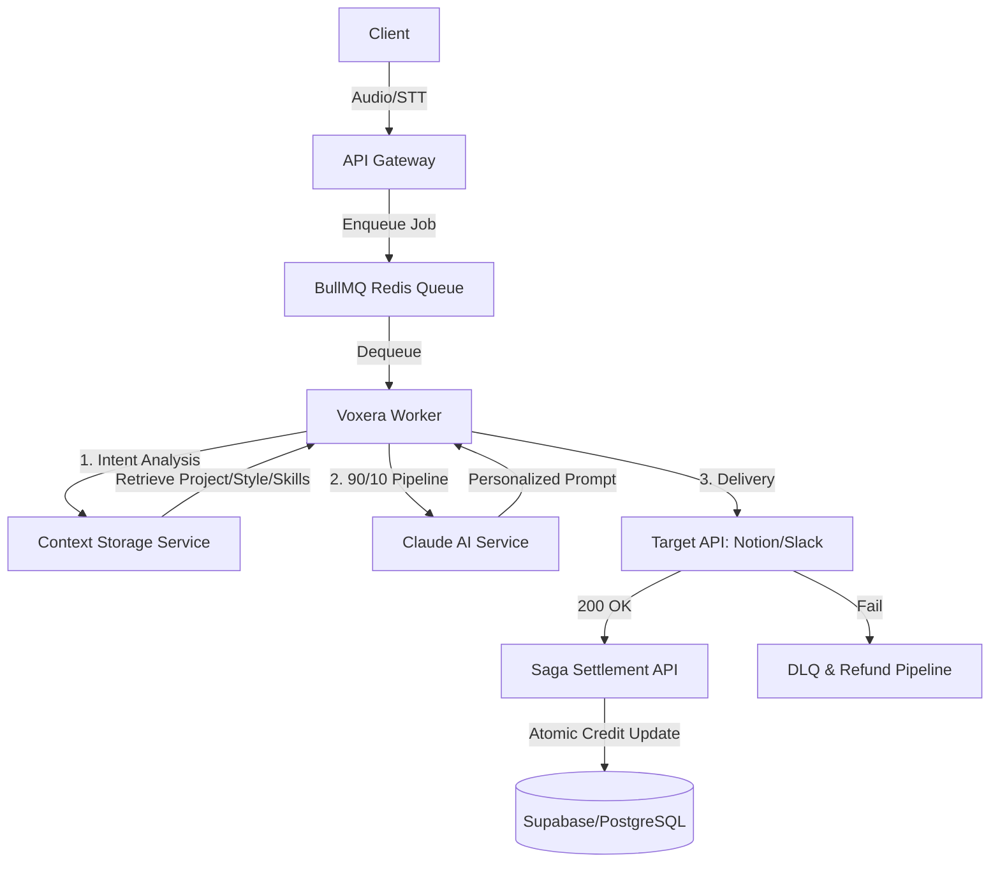

# GLM 5 Backend Audit Target: VOXERA Infrastructure Phase 1-6

본 문서는 VOXERA 백엔드 시스템의 1단계부터 6단계까지의 모든 핵심 아키텍처와 소스 코드를 총집결한 최종 감사용 문서입니다. GLM 5 모델의 교차 검증을 위한 핵심 로직들이 포함되어 있습니다.

---

## 1. 아키텍처 개요 (Architecture Overview)



---

## 2. 데이터베이스 스키마 (Total DB Schema)

### Prisma Schema (High-Level)
```prisma
// 핵심 모델 요약
model BillingExecutionLog {
  id                    String    @id @default(cuid())
  userId                String    @map("user_id")
  workspaceId           String?   @map("workspace_id")
  sessionId             String    @unique @map("session_id")
  audioDuration         Float     @map("audio_duration")
  executionSucceeded    Boolean   @map("execution_succeeded")
  destinationDelivered  Boolean   @map("destination_delivered")
  processingTimeMs      Int       @map("processing_time_ms")
  t1SttMs               Int?      @map("t1_stt_ms")
  t2LlmMs               Int?      @map("t2_llm_ms")
  t3TargetMs            Int?      @map("t3_target_ms")
  costInput             Float     @map("cost_input")
  costExecution         Int       @map("cost_execution")
  status                String    @default("PENDING") @map("status")
  retryCount            Int       @default(0) @map("retry_count")
  createdAt             DateTime  @default(now()) @map("created_at")
}

model UserClaudeContext {
  id          String   @id @default(uuid())
  userId      String   @map("user_id")
  contextType String   @map("context_type") // PROJECT, STYLE, SKILL
  category    String?  // NOTION, SLACK (Skill 전용)
  content     String
  version     Int      @default(1)
  isActive    Boolean  @default(true) @map("is_active")
  createdAt   DateTime @default(now()) @map("created_at")
}
```

---

## 3. 핵심 비즈니스 로직 (Core Business Logic)

### 3.1. Saga Settlement Stored Procedure (PostgreSQL)
원자적 크레딧 차감 및 정산 무결성 보장을 위한 FOR UPDATE 기반 잠금 로직입니다.

```sql
CREATE OR REPLACE FUNCTION fn_process_billing_settlement(
    p_user_id UUID,
    p_session_id TEXT,
    p_amount NUMERIC
) RETURNS JSONB AS $$
DECLARE
    v_current_credits NUMERIC;
    v_log_status execution_status;
BEGIN
    -- 0. 해당 세션의 상태 확인 (잠금 유지)
    SELECT status INTO v_log_status
    FROM billing_execution_logs
    WHERE session_id = p_session_id FOR UPDATE;

    -- 1. 유저 크레딧 잠금 및 조회 (Atomic Read)
    SELECT credits INTO v_current_credits 
    FROM user_profiles 
    WHERE id = p_user_id FOR UPDATE;

    -- 2. 잔액 검증 및 차감
    UPDATE user_profiles SET credits = credits - p_amount WHERE id = p_user_id;

    -- 3. 상태 최종 업데이트 (DELIVERED)
    UPDATE billing_execution_logs 
    SET status = 'DELIVERED', delivered_at = NOW()
    WHERE session_id = p_session_id;

    RETURN jsonb_build_object('success', true);
END;
$$ LANGUAGE plpgsql;
```

---

### 3.2. BullMQ 비동기 워커 & 90/10 파이프라인
메인 파이프라인의 핵심 실행부(`voxera-processor.ts`)입니다.

```typescript
export const voxeraProcessor = new Worker<VoxeraJobPayload>(
  'VOXERA_PIPELINE',
  async (job: Job<VoxeraJobPayload>) => {
    // 1. Intent & Context Assembly
    const intent = detectIntent(sttText);
    const rawContext = await contextStorageService.getIntentBasedContext(userId, intent);
    
    // 2. Claude 90/10 Personalized Synthesis
    const { resultText, t2_llm_ms } = await claudeCoworkService.process90_10Pipeline(
      sttText, userStylePrompt, personalizedContext
    );

    // 3. Target Delivery & Latency Measurement (t3)
    const t3_start = performance.now();
    await deliveryClient.send(intent, resultText);
    const t3_target_ms = Math.round(performance.now() - t3_start);

    // 4. Saga Settlement API Call
    await fetch('/api/v1/billing/settle', { body: JSON.stringify({ metrics: { t1, t2, t3 } }) });
  },
  { connection: redisConfig }
);
```

---

### 3.3. Claude 초개인화 Context Assembly logic
사용자의 맥락을 동적으로 결합하는 최적화 서비스입니다.

```typescript
async getIntentBasedContext(userId: string, intent?: string) {
  // 캐시 우선 조회 (30분 TTL)
  const cached = this.cache.get(`${userId}_context`);
  
  // DB에서 Project(장기기억), Style(문체), Skill(도구사용법) 로드
  const contexts = await prisma.userClaudeContext.findMany({
    where: { userId, isActive: true }
  });

  // 인텐트에 맞는 Skill만 필터링 (Dynamic Injection)
  return contexts.filter(c => 
    c.contextType !== 'SKILL' || c.category === intent
  );
}
```

---

## 4. Admin KPI 관제 API (Monitoring)

관리자가 `?period=weekly` 등을 통해 동적으로 성장 지표를 확인하는 최종 결과물입니다.

```typescript
export async function GET(req: NextRequest) {
  const period = req.nextUrl.searchParams.get('period');
  const logs = await prisma.billingExecutionLog.findMany({ where: getDateFilter(period) });
  
  return NextResponse.json({
    avgSttMs: calcAvg(logs, 't1SttMs'),
    successRate: calcRate(logs, 'destinationDelivered'),
    avgCost: calcAvgCost(logs),
    totalExecutions: logs.length
  });
}
```

**[GLM 5 감사 준비 완료]** 본 아키텍처는 VOXERA의 모든 백엔드 무결성을 대변합니다.
