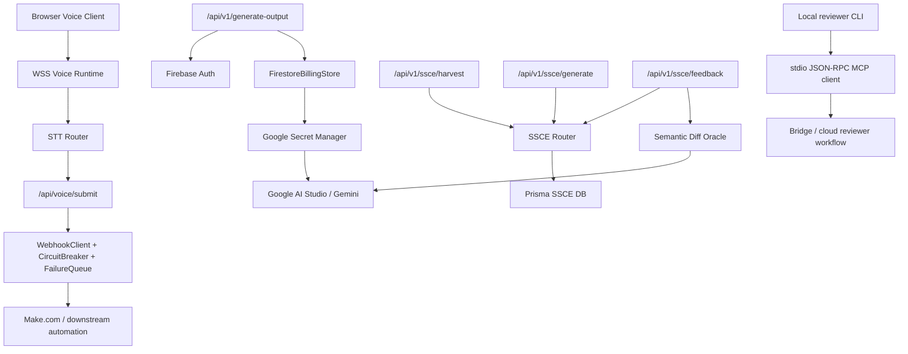

# VOXERA Backend Architecture

- Updated: 2026-03-31
- Scope: current backend systems that exist in this repository and their operational contracts

## 1. System Boundary

VOXERA backend is the execution core behind a voice-first B2B agent. The current codebase contains four backend lanes:

1. Voice intake and delivery
2. Paid Gemini output generation with two-phase billing settlement
3. SSCE personalization and style compounding
4. Local reviewer and MCP bridge infrastructure

The backend is intentionally stateful in a few places:

- Firestore for wallet and billing transaction truth
- Prisma + SQLite for SSCE personalization state
- in-process circuit breaker and retry queue for Make.com delivery reliability

## 2. Runtime Topology

## 3. UAS 5-Stage Flow

The current backend follows a five-stage UAS execution pattern:

1. `U1 Ingest`
   - Voice PCM arrives through WSS.
   - Structured HTTP requests arrive through Next.js route handlers.
   - Every external payload is Zod-validated before business logic runs.

2. `U2 Authenticate And Bind`
   - Voice submit binds `clientRequestId` before downstream delivery.
   - Paid generation verifies Firebase identity.
   - SSCE routes bind `workspace_id`, optional destination, recipient, and task scope.

3. `A1 Analyze And Route`
   - STT provider routing selects Whisper by default and Return Zero only for approved Korean premium or high-risk flows.
   - SSCE builds a four-layer style stack: `global`, `destination`, `recipient`, `task`.
   - Gemini-backed Oracle classifies accepted draft edits into lexical, structural, and tone deltas.

4. `A2 Act And Deliver`
   - `/api/voice/submit` signs and sends payloads to Make.com with retry and circuit-breaker protections.
   - `/api/v1/generate-output` calls Gemini through Secret Manager-backed credentials after wallet reserve succeeds.
   - SSCE `generate` produces a compounded draft and `feedback` writes final artifact learning back into signatures.

5. `S1 Settle And Persist`
   - Billing commits as `reserve -> execute -> deduct/refund`.
   - SSCE persists artifacts, signatures, reference edges, and style events.
   - Output routes trigger `revalidateTag` or return downstream state so UI and data layers can refresh safely.

## 4. Gemini 10-Step Reasoning Protocol

The current Gemini-backed backend path is organized as the following reasoning contract:

1. Normalize request payload through Zod.
2. Bind runtime context: workspace, destination, recipient, task, and request id.
3. Derive deterministic heuristic baseline from draft vs final artifact.
4. Compress prompt input to capped draft/final text, outlines, notes, and baseline hints.
5. Send strict system instruction that forbids prose and requires exact schema output.
6. Run Gemini in strict JSON mode with:
   - `responseMimeType = application/json`
   - `responseJsonSchema`
   - `thinkingBudget = 0`
   - deterministic sampling controls
7. Parse returned JSON directly with `JSON.parse`.
8. Validate wire payload with compact Zod schema and enum-constrained tone shifts.
9. Merge Gemini judgment with deterministic baseline to construct the domain result:
   - `lexical_changes`
   - `structure_changes`
   - `tone_delta`
   - `diff_summary`
   - `scope_updates`
10. Persist style-learning results into SSCE signatures and events, or fail fast if structured output is invalid.

## 5. Backend API Surface

### 5.1 Voice Delivery

- Route: [route.ts](C:/Users/Master/Documents/Playground-ssce-main/src/app/api/voice/submit/route.ts)
- Responsibility:
  - parse `voiceSubmitRequestSchema`
  - construct and validate Make.com payload
  - send through `WebhookClient`
  - fall back to `FailureQueue` on transient failure
- Reliability controls:
  - `CircuitBreaker`
  - signed webhook payloads
  - retry with backoff
  - queued replay path

### 5.2 Paid Output Generation

- Route: [route.ts](C:/Users/Master/Documents/Playground-ssce-main/src/app/api/v1/generate-output/route.ts)
- Responsibility:
  - Firebase Auth verification
  - Firestore wallet reserve
  - Gemini output generation
  - deduct or refund settlement
  - cache revalidation
- Billing truth lives in:
  - [firestore-billing-store.ts](C:/Users/Master/Documents/Playground-ssce-main/src/server/billing/firestore-billing-store.ts)
  - [pay-per-output-service.ts](C:/Users/Master/Documents/Playground-ssce-main/src/server/billing/pay-per-output-service.ts)

### 5.3 SSCE Personalization APIs

- Routes:
  - [harvest](C:/Users/Master/Documents/Playground-ssce-main/src/app/api/v1/ssce/harvest/route.ts)
  - [generate](C:/Users/Master/Documents/Playground-ssce-main/src/app/api/v1/ssce/generate/route.ts)
  - [feedback](C:/Users/Master/Documents/Playground-ssce-main/src/app/api/v1/ssce/feedback/route.ts)
- App-router wrappers delegate to:
  - [route-helpers.ts](C:/Users/Master/Documents/Playground-ssce-main/apps/api/src/app/api/v1/ssce/route-helpers.ts)
  - [ssce-router.ts](C:/Users/Master/Documents/Playground-ssce-main/apps/api/src/routes/ssce-router.ts)
- Shared request and response contracts live in:
  - [ssce-zod.ts](C:/Users/Master/Documents/Playground-ssce-main/packages/adapter/src/validators/ssce-zod.ts)

## 6. SSCE Data Model

Physical schema:

- [schema.prisma](C:/Users/Master/Documents/Playground-ssce-main/apps/api/src/db/schema.prisma)
- [ssce-schema.ts](C:/Users/Master/Documents/Playground-ssce-main/apps/api/src/db/schema/ssce-schema.ts)

Core tables:

1. `artifacts`
   - reference inputs
   - generated drafts
   - accepted final artifacts

2. `style_signatures`
   - four-layer style memory
   - unique scope key per workspace and scope type
   - confidence score and signal count

3. `style_events`
   - harvest, generate, feedback history
   - diff summary snapshot
   - payload snapshot for audit/debug

4. `reference_edges`
   - links between artifacts
   - `references`, `derived_from`, `context_for`, `finalized_from`

## 7. External Integration Mapping

| Integration | Current backend mapping | Status |
| --- | --- | --- |
| Google AI Studio / Gemini | Paid output generation and SSCE semantic oracle | Active |
| Firebase Auth | identity gate for paid generation | Active |
| Firestore | wallet and billing transaction truth | Active |
| Google Secret Manager | Gemini API key retrieval for paid generation | Active |
| Make.com | downstream webhook execution path for voice submit | Active |
| Notion API | architectural target is backend direct-write rather than Make.com relay | Planned / documented |
| Google Workspace | Sheets-centered execution board with Apps Script HTML modal dashboard | Documented integration path |
| KakaoTalk | reserved for later business account and template approval flow | Deferred |
| MCP reviewer bridge | local stdio reviewer polling and feedback submission | Active local tooling |

## 8. Notion And Kakao Mapping Rules

Current documented integration policy from [2026-03-21-notion-direct-write-google-workspace-handoff.md](C:/Users/Master/Documents/Playground-ssce-main/docs/2026-03-21-notion-direct-write-google-workspace-handoff.md):

- Notion should be written directly by backend API integration, not primarily routed through Make.com.
- Google Workspace should treat Sheets as the central execution board and attach Docs, Calendar, and Mail actions around sheet rows.
- KakaoTalk is intentionally deferred until business-account and template approval constraints are cleared.

## 9. Local Reviewer And MCP Path

MCP reviewer components:

- [contracts.ts](C:/Users/Master/Documents/Playground-ssce-main/src/server/mcp/contracts.ts)
- [json-rpc.ts](C:/Users/Master/Documents/Playground-ssce-main/src/server/mcp/json-rpc.ts)
- [stdio-json-rpc-client.ts](C:/Users/Master/Documents/Playground-ssce-main/src/server/mcp/stdio-json-rpc-client.ts)
- [reviewer-agent.ts](C:/Users/Master/Documents/Playground-ssce-main/src/server/mcp/reviewer-agent.ts)
- [reviewer-static-analysis.ts](C:/Users/Master/Documents/Playground-ssce-main/src/server/mcp/reviewer-static-analysis.ts)

Current protocol:

1. Local reviewer polls updates through `updates.pull`.
2. Static analysis validates schema integrity and secret hygiene.
3. Reviewer submits allow or deny feedback through `reviews.submit`.
4. The bridge stays local-first over stdio and JSON-RPC 2.0.

## 10. Reliability And Failure Boundaries

Current hard guarantees:

- Audio transport remains `AudioWorklet + PCM over WSS` only.
- 15-second recording cutoff stays reducer-driven.
- `clientRequestId` remains the duplicate-lock truth before async submission.
- SSCE APIs reject invalid payloads through shared Zod contracts.
- Paid generation either deducts or refunds; no silent partial settlement.

Current known backend risks:

1. SSCE feedback path depends on a live Gemini round-trip and currently fails fast if structured output ever violates the strict schema.
2. SSCE signature upsert logic still has a concurrency race around `findUnique -> create/update` on the unique scope key.
3. Large artifact payloads can inflate SSCE event snapshots and increase SQLite write cost.

## 11. Operational Closure State

As of this document:

- strict JSON Gemini Oracle tuning is active
- repeated `test:ssce` runs no longer emit `repair-baseline`
- reviewer failure-mode analysis has been executed
- backend architecture is documented for the next frontend and integration phases
