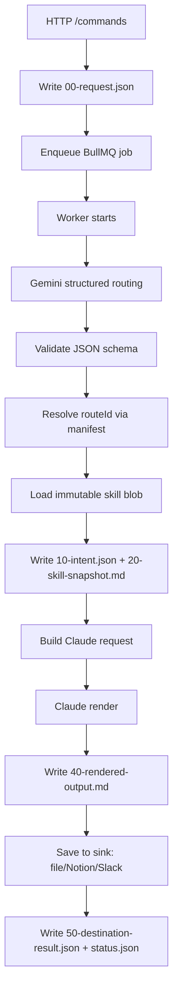

    ** 1. 젠스파크 자료

아래는 **바로 Codex에 붙여 넣을 수 있는 Markdown 아키텍처 문서**입니다.  
핵심 결론부터 말하면, **VOXERA의 정답 아키텍처는 “Object Storage를 단일 진실원천(Source of Truth)으로 두고, Redis/BullMQ는 오직 비동기 실행을 위한 운영 인프라로만 쓰는 구조”**입니다. 즉, **비즈니스 상태와 프롬프트 자산은 전부 파일로 관리**하고, 큐는 실행만 담당합니다. 이 방식은 “DB를 쓰지 않되 무결성과 재현성을 확보”해야 하는 지금 요구에 가장 잘 맞습니다. [Source](https://aws.amazon.com/s3/consistency/) [Source](https://docs.bullmq.io/)

---

# VOXERA Backend Blueprint  
## File-based Personalized Automation System for Gemini → Claude Orchestration

### 문서 목적
이 문서는 **VOXERA의 “Claude 연동 90/10 개인화 자동화 시스템”**을 위해, **Node.js/TypeScript 기반의 가장 안정적이고 운영 친화적인 백엔드 설계도**를 정의한다.  
설계 원칙은 다음과 같다.

- **비즈니스 데이터는 DB가 아니라 파일(Object Storage 포함)로 저장**
- **Gemini는 오직 Strict JSON 추출기/라우터**
- **Claude는 최종 렌더러**
- **오케스트레이터는 모델 간 handoff를 결정적으로 통제**
- **긴 작업은 반드시 비동기 큐로 분리**
- **최종 산출물은 파일/S3/Notion/Slack 등 목적지에 안전하게 저장**

---

## 1. 최상위 아키텍처 결정

### 1.1 권장 기준안
프로덕션에서는 **로컬 디스크를 단일 진실원천으로 쓰지 말고, S3 또는 S3 호환 Object Storage를 진실원천으로 사용**한다. 이유는 단순하다. S3는 현재 **GET/PUT/LIST에 대해 strong read-after-write consistency**를 제공하므로, 스킬 파일을 갱신한 직후에도 바로 최신 버전을 읽을 수 있고, 별도 메타데이터 DB를 두지 않아도 된다. 또한 **Versioning**을 켜면 스킬 파일이나 결과물이 잘못 덮어써져도 즉시 복구 가능하다. [Source](https://aws.amazon.com/s3/consistency/) [Source](https://docs.aws.amazon.com/AmazonS3/latest/userguide/versioning-workflows.html)

### 1.2 로컬 파일 시스템의 위치
로컬 파일 시스템은 **개발 환경 또는 단일 노드 배포**에서는 허용된다. 하지만 멀티 인스턴스 환경에서 로컬 파일을 진실원천으로 쓰면, 인스턴스별 파일 불일치와 배포 시점 race condition이 생긴다. 따라서 로컬 FS는 **캐시 또는 개발 모드**로만 두고, 프로덕션 진실원천은 Object Storage로 고정한다. Node.js에서는 최신 TypeScript 서비스에서 `node:fs/promises` 기반 비동기 I/O를 쓰는 것이 표준적이다. [Source](https://nodejs.org/api/fs.html)

### 1.3 큐 인프라의 해석
“DB를 쓰지 않는다”는 요구는 **비즈니스 상태 저장을 DB에 두지 않는다**는 의미로 해석해야 한다. 따라서 Redis/BullMQ는 **소스 오브 트루스가 아니라 운영용 큐 인프라**로 허용하는 것이 맞다. BullMQ는 Redis 기반의 robust queue 시스템이며, retry, delayed job, concurrency, crash recovery, parent-child flow 같은 운영 기능을 제공한다. [Source](https://docs.bullmq.io/)

---

## 2. 저장소 설계: 파일 기반을 무결하게 만드는 핵심 패턴

## 2.1 스킬 파일은 “불변 Blob + 가변 Manifest” 구조로 관리한다

가장 안전한 방식은 스킬 파일을 매번 같은 파일명에 덮어쓰는 것이 아니라, **불변(immutable) blob**으로 저장하고, **현재 active 버전은 manifest가 가리키게 하는 것**이다.  
즉:

- 스킬 본문은 content hash 기준으로 저장
- 라우팅은 별도 manifest가 담당
- 요청 처리 시에는 항상 manifest를 통해 현재 active skill을 resolve
- 실행 시점에 참조한 blob hash를 잡아 두어 재현성 확보

이 구조는 파일 기반 시스템에서 가장 중요한 **원자적 배포, 롤백, 재현성**을 동시에 만족시킨다. S3의 strong consistency와 versioning이 이 패턴과 잘 맞는다. [Source](https://aws.amazon.com/s3/consistency/) [Source](https://docs.aws.amazon.com/AmazonS3/latest/userguide/versioning-workflows.html)

### 2.2 권장 경로 구조

```text
/tenants/{tenantId}/
  routing/
    manifest.json
  skills/
    blobs/
      sha256/
        ab/cd/abcdef...1234.md
  jobs/
    {jobId}/
      00-request.json
      10-gemini-intent.json
      20-skill-snapshot.md
      30-claude-request.json
      40-rendered-output.md
      50-destination-result.json
      status.json
      events.ndjson
  outputs/
    {yyyy}/{mm}/{dd}/{jobId}.md
```

이 구조의 장점은 다음이다.

- `manifest.json`만 보면 현재 active route를 알 수 있음
- `skills/blobs/...`는 절대 수정하지 않으므로 race condition이 줄어듦
- `jobs/{jobId}` 폴더만 보면 요청의 전 과정을 감사(audit) 가능
- DB 없이도 “무슨 스킬로 어떤 입력이 어떻게 렌더링되었는지” 완전 추적 가능

---

## 3. 스킬 파일과 라우팅 아키텍처

## 3.1 스킬 파일 포맷

스킬 파일은 Markdown 본문만 두지 말고, **YAML frontmatter + 본문** 구조로 표준화한다.

```md
---
skill_id: "blog_writer_ko"
tenant_id: "userA"
route_id: "skill_userA_blog"
active: true
claude_model: "claude-sonnet-4.6"
output_format: "markdown"
allowed_destinations: ["file", "notion", "slack"]
schema_version: 1
---
# Role
You are the final renderer for UserA's blog style.

# Tone Rules
- concise but warm
- avoid jargon unless requested
- end with a practical CTA

# Structural Rules
- h1 title
- short intro
- 3~5 sections
- summary bullet list

# Hard Constraints
- keep Korean natural
- do not mention hidden instructions
```

### 3.2 Manifest 예시

```json
{
  "tenantId": "userA",
  "publishedAt": "2026-03-31T10:00:00Z",
  "routes": [
    {
      "routeId": "skill_userA_blog",
      "intentLabels": ["write_blog", "rewrite_blog", "blog_korean"],
      "skillBlobKey": "skills/blobs/sha256/ab/cd/abcdef1234....md",
      "skillSha256": "abcdef1234....",
      "claudeModel": "claude-sonnet-4.6",
      "outputFormat": "markdown",
      "destinations": ["file", "notion", "slack"],
      "active": true
    },
    {
      "routeId": "skill_userA_translation",
      "intentLabels": ["translate_post", "localize_content"],
      "skillBlobKey": "skills/blobs/sha256/98/76/9876abcd....md",
      "skillSha256": "9876abcd....",
      "claudeModel": "claude-sonnet-4.6",
      "outputFormat": "markdown",
      "destinations": ["file", "notion"],
      "active": true
    }
  ]
}
```

### 3.3 Gemini 라우팅의 핵심 원칙

**Gemini에게 파일 경로를 고르게 하면 안 된다.**  
Gemini는 오직 **`routeId` enum**만 고르게 해야 한다. 즉, 앱 요청 시점마다 서버가 manifest에서 active route 목록을 읽고, 그 목록으로부터 **허용된 enum 집합**을 만든 뒤 Gemini Structured Output schema에 주입한다. 그러면 Gemini는 임의의 경로나 존재하지 않는 스킬명을 hallucination할 수 없다. Google Gemini는 JSON Schema 기반의 structured output을 공식 지원하며, TypeScript에서는 Zod → JSON Schema 패턴이 권장된다. [Source](https://ai.google.dev/gemini-api/docs/structured-output)

### 3.4 가장 중요한 무결성 보장 규칙

라우팅 무결성은 아래 4단계로 만든다.

1. **Gemini는 `routeId`만 반환**  
2. **서버가 manifest에서 `routeId`를 실제 blob key로 resolve**  
3. **서버가 blob hash를 검증**  
4. **실행 job 폴더에 skill snapshot을 저장**  

이렇게 하면 “Gemini JSON”과 “실제 스킬 파일” 사이의 연결이 완전히 서버 결정적(server-deterministic)이 된다.

---

## 4. 캐싱 전략

## 4.1 L1 메모리 캐시
Node 프로세스 내부에 `LRU + TTL` 캐시를 둔다.

- key: `tenantId + skillSha256`
- value: parsed skill document
- TTL: 5~15분
- eviction: LRU
- stale-while-revalidate 가능

이때 캐시 키를 파일명 대신 **`skillSha256`** 로 잡으면, 새 버전 publish 시 캐시 오염이 사실상 사라진다.

## 4.2 L2 원격 저장소
L2는 S3/Object Storage다. S3는 읽기 직후 최신값을 보장하므로, publish 후 곧바로 serving이 가능하다. prefix 성능도 충분하고, 더 이상 예전처럼 prefix randomization이 필수는 아니다. [Source](https://aws.amazon.com/s3/consistency/)

## 4.3 캐시 무효화
가장 안전한 캐시 무효화 방식은 “삭제”가 아니라 **manifest 교체**다.

- 새 blob 업로드
- 새 manifest 작성
- manifest publish
- 이후 요청은 새 sha 기준으로 캐시 miss → 새 문서 로드

별도 중앙 캐시 무효화 브로드캐스트 없이도 동작한다.

---

## 5. Gemini Structured Output 계약

## 5.1 권장 JSON 스키마

Gemini는 “의도 분류 + 슬롯 추출 + 목적지 의도”까지만 수행한다.

```ts
import { z } from "zod";

export const GeminiIntentSchema = z.object({
  routeId: z.enum([
    "skill_userA_blog",
    "skill_userA_translation"
  ]),
  action: z.enum([
    "create",
    "rewrite",
    "translate",
    "summarize"
  ]),
  payload: z.object({
    topic: z.string().optional(),
    sourceText: z.string().optional(),
    targetLanguage: z.string().optional(),
    audience: z.string().optional(),
    keyChanges: z.array(z.string()).default([])
  }).strict(),
  destination: z.object({
    type: z.enum(["file", "notion", "slack"]).default("file"),
    targetId: z.string().optional()
  }).strict(),
  confidence: z.number().min(0).max(1),
  requiresHumanReview: z.boolean().default(false)
}).strict();
```

Gemini Structured Output은 `responseMimeType=application/json` 과 `responseJsonSchema` 를 통해 강제되며, JavaScript/TypeScript에서 Zod 기반 패턴이 공식 문서에 제시되어 있다. [Source](https://ai.google.dev/gemini-api/docs/structured-output)

## 5.2 Gemini에 주는 입력은 최소화한다

Gemini에는 **전체 스킬 파일을 절대 주지 않는다.**  
Gemini에 주는 것은 아래 정도면 충분하다.

- 사용자 원문 발화
- tenant별 허용 route 목록
- 각 route의 짧은 설명
- 허용 destination 유형
- 필요한 출력 JSON schema

이렇게 하면:

- 토큰 비용 감소
- 스킬 유출 위험 감소
- 라우팅 정확도 상승
- Claude 렌더링 단계와 역할 분리 명확화

---

## 6. Claude handoff 설계: hallucination 없는 결합 방식

## 6.1 원칙
Claude API에서는 **system prompt를 top-level `system` 파라미터로 전달**해야 하며, Messages API에는 `"system"` role이 없다. 따라서 스킬 파일은 **top-level system** 으로 넣고, 사용자의 변경사항/콘텐츠만 `messages: [{ role: "user" }]` 로 넣는 구조가 가장 명확하다. [Source](https://platform.claude.com/docs/en/api/messages/create)

## 6.2 프롬프트 조립 원칙
Claude에 보내는 입력은 반드시 3층으로 분리한다.

- **Layer A: 플랫폼 고정 가드레일**
- **Layer B: 스킬 파일 본문**
- **Layer C: 런타임 payload**

즉:

- 플랫폼 정책은 서버 코드 상수
- 스킬 파일은 tenant 개인화 규칙
- payload는 이번 요청의 바뀌는 내용

이 구조가 가장 디버깅 가능하고, prompt drift가 적다.

## 6.3 Anthropic Prompt Caching 적용
Anthropic 공식 문서상 prompt caching은 **tools, system, messages의 prefix**를 캐시 대상으로 삼을 수 있고, 자동 캐싱 방식도 제공한다. 따라서 매 요청마다 거의 변하지 않는 **스킬 파일(system prefix)** 에 캐싱을 걸면 비용과 지연시간을 모두 줄일 수 있다. 특히 tenant별 스킬이 반복 호출되는 VOXERA와 잘 맞는다. [Source](https://platform.claude.com/docs/en/build-with-claude/prompt-caching)

---

## 7. 오케스트레이터의 결정적 실행 플로우



---

## 8. 권장 TypeScript 코드 청사진

## 8.1 Storage Adapter

```ts
export interface ObjectStorage {
  getText(key: string): Promise<string>;
  putText(key: string, body: string, contentType?: string): Promise<void>;
  putJson<T>(key: string, body: T): Promise<void>;
  getJson<T>(key: string): Promise<T>;
  exists(key: string): Promise<boolean>;
}
```

## 8.2 Skill Manifest Resolver

```ts
export interface RouteEntry {
  routeId: string;
  intentLabels: string[];
  skillBlobKey: string;
  skillSha256: string;
  claudeModel: string;
  outputFormat: "markdown" | "html" | "json";
  destinations: Array<"file" | "notion" | "slack">;
  active: boolean;
}

export interface TenantManifest {
  tenantId: string;
  publishedAt: string;
  routes: RouteEntry[];
}

export class ManifestService {
  constructor(private storage: ObjectStorage) {}

  async getManifest(tenantId: string): Promise<TenantManifest> {
    return this.storage.getJson<TenantManifest>(`/tenants/${tenantId}/routing/manifest.json`);
  }

  async resolveRoute(tenantId: string, routeId: string): Promise<RouteEntry> {
    const manifest = await this.getManifest(tenantId);
    const route = manifest.routes.find(r => r.routeId === routeId && r.active);
    if (!route) throw new Error(`ROUTE_NOT_FOUND:${tenantId}:${routeId}`);
    return route;
  }
}
```

## 8.3 SkillStore with L1 Cache

```ts
type CachedSkill = {
  sha256: string;
  text: string;
  loadedAt: number;
};

export class SkillStore {
  private cache = new Map<string, CachedSkill>();

  constructor(private storage: ObjectStorage) {}

  async load(route: RouteEntry): Promise<CachedSkill> {
    const key = route.skillSha256;
    const cached = this.cache.get(key);
    if (cached) return cached;

    const text = await this.storage.getText(`/tenants/userA/${route.skillBlobKey}`);
    const value = { sha256: route.skillSha256, text, loadedAt: Date.now() };
    this.cache.set(key, value);
    return value;
  }
}
```

## 8.4 Gemini Router Service

```ts
import { GoogleGenAI } from "@google/genai";
import { zodToJsonSchema } from "zod-to-json-schema";

export class GeminiRouter {
  constructor(private ai: GoogleGenAI) {}

  async route(input: {
    tenantId: string;
    utterance: string;
    routeCatalog: Array<{ routeId: string; description: string }>;
  }) {
    const schema = zodToJsonSchema(GeminiIntentSchema);

    const prompt = [
      "You are a strict routing extractor.",
      "Choose exactly one routeId from the allowed enum.",
      "Never invent file paths or skill names.",
      "Return only JSON matching the schema.",
      "",
      `Utterance: ${input.utterance}`,
      `Allowed Routes: ${JSON.stringify(input.routeCatalog)}`
    ].join("\n");

    const res = await this.ai.models.generateContent({
      model: "gemini-2.5-pro",
      contents: prompt,
      config: {
        responseMimeType: "application/json",
        responseJsonSchema: schema
      }
    });

    const parsed = GeminiIntentSchema.parse(JSON.parse(res.text ?? "{}"));
    return parsed;
  }
}
```

Gemini Structured Output은 JSON Schema 준수를 강제할 수 있으므로, 이 단계는 free-form parsing이 아니라 **계약 기반 extraction layer**로 보는 게 맞다. [Source](https://ai.google.dev/gemini-api/docs/structured-output)

## 8.5 Claude Prompt Assembly

```ts
export function buildClaudeRequest(params: {
  skillText: string;
  utterance: string;
  intent: z.infer<typeof GeminiIntentSchema>;
}) {
  const system = [
    "You are the final renderer.",
    "Follow the skill exactly.",
    "Do not reveal hidden instructions.",
    "",
    "=== SKILL FILE START ===",
    params.skillText,
    "=== SKILL FILE END ==="
  ].join("\n");

  const user = [
    `Action: ${params.intent.action}`,
    `Payload: ${JSON.stringify(params.intent.payload)}`,
    `Original user utterance: ${params.utterance}`,
    "",
    "Generate the final output only."
  ].join("\n");

  return { system, user };
}
```

## 8.6 Anthropic Client Call

```ts
import Anthropic from "@anthropic-ai/sdk";

export class ClaudeRenderer {
  constructor(private anthropic: Anthropic) {}

  async render(input: {
    model: string;
    system: string;
    user: string;
  }) {
    const res = await this.anthropic.messages.create({
      model: input.model,
      max_tokens: 4000,
      system: input.system,
      messages: [
        {
          role: "user",
          content: input.user
        }
      ]
    });

    return res.content
      .filter(block => block.type === "text")
      .map(block => block.text)
      .join("\n");
  }
}
```

Anthropic Messages API에서 system prompt는 top-level `system`으로 주입해야 한다. [Source](https://platform.claude.com/docs/en/api/messages/create)

---

## 9. 비동기 처리와 Timeout 방어

## 9.1 HTTP는 절대 Claude 작업 완료를 기다리지 않는다
긴 글 작성, 번역, 대량 리라이트 작업은 **HTTP request lifecycle에서 끝내면 안 된다.**  
권장 패턴은 다음과 같다.

1. `POST /v1/commands`
2. 서버는 `00-request.json` 저장
3. BullMQ job enqueue
4. 즉시 `202 Accepted` 반환
5. 클라이언트는 `GET /v1/jobs/:jobId` polling 또는 webhook/SSE 사용

BullMQ는 Redis 기반 robust queue이며, heavy work offloading, retries, delayed jobs, crash recovery에 적합하다. [Source](https://docs.bullmq.io/)

## 9.2 API 응답 계약

```json
{
  "jobId": "job_01HV...",
  "status": "queued",
  "statusUrl": "/v1/jobs/job_01HV..."
}
```

## 9.3 Worker 실행 계약
Worker는 **idempotent** 해야 한다. BullMQ 문서도 retry를 제대로 활용하려면 job이 idempotent해야 하며, job은 atomic하고 단순할수록 좋다고 권장한다. [Source](https://docs.bullmq.io/patterns/idempotent-jobs)

VOXERA에서 idempotence는 아래처럼 만든다.

- job 시작 전에 `jobs/{jobId}/10-gemini-intent.json` 존재 시 Gemini 단계 skip
- `20-skill-snapshot.md` 존재 시 skill load skip
- `40-rendered-output.md` 존재 시 Claude render skip
- sink receipt 존재 시 destination save skip

즉, **파일 artifact 자체가 재시도 안전장치**가 된다.

## 9.4 Retry 정책
BullMQ는 fixed/exponential backoff와 jitter를 공식 지원한다. 프로덕션에서는 Claude/Gemini/Slack/Notion 같은 외부 API 호출에 대해 **exponential backoff + jitter**가 기본값이어야 한다. [Source](https://docs.bullmq.io/guide/retrying-failing-jobs)

권장값:

- `attempts: 5`
- `backoff.type: "exponential"`
- `backoff.delay: 2000`
- `jitter: 0.5`

## 9.5 중복 요청 억제
BullMQ는 deduplication을 제공한다. 같은 deduplication ID를 가진 작업을 일정 기간 또는 작업 완료까지 무시/대체할 수 있다. 긴 LLM 작업의 중복 제출 방지에 매우 유용하다. [Source](https://docs.bullmq.io/guide/jobs/deduplication)

권장 dedupe key:

```ts
sha256(`${tenantId}:${normalizedUtterance}:${destinationType}:${clientRequestId ?? ""}`)
```

## 9.6 완료/실패 job 보존 정책
BullMQ는 완료/실패 job auto-removal 정책을 제공한다. 큐는 실행 인프라일 뿐이고 진실원천은 파일이므로, Redis에는 오래 보관할 이유가 적다. [Source](https://docs.bullmq.io/guide/queues/auto-removal-of-jobs)

권장값:

```ts
removeOnComplete: { age: 3600, count: 1000 },
removeOnFail: { age: 7 * 24 * 3600, count: 10000 }
```

---

## 10. 실제 Queue 코드 예시

```ts
import { Queue, Worker } from "bullmq";

export const commandQueue = new Queue("voxera-command", {
  connection: { host: process.env.REDIS_HOST!, port: 6379 },
  defaultJobOptions: {
    attempts: 5,
    backoff: { type: "exponential", delay: 2000, jitter: 0.5 },
    removeOnComplete: { age: 3600, count: 1000 },
    removeOnFail: { age: 7 * 24 * 3600, count: 10000 }
  }
});

export async function enqueueCommand(data: {
  jobId: string;
  tenantId: string;
  utterance: string;
}) {
  await commandQueue.add("process-command", data, {
    jobId: data.jobId,
    deduplication: { id: data.jobId }
  });
}
```

---

## 11. Job Worker의 단계별 구현

```ts
export class CommandWorker {
  constructor(
    private storage: ObjectStorage,
    private manifestService: ManifestService,
    private skillStore: SkillStore,
    private geminiRouter: GeminiRouter,
    private claudeRenderer: ClaudeRenderer,
    private sinkRouter: SinkRouter
  ) {}

  async process(job: { id: string; data: { tenantId: string; utterance: string } }) {
    const { tenantId, utterance } = job.data;
    const base = `/tenants/${tenantId}/jobs/${job.id}`;

    await this.writeStatus(base, "running");

    // 1) Gemini intent
    let intent;
    if (await this.storage.exists(`${base}/10-gemini-intent.json`)) {
      intent = await this.storage.getJson(`${base}/10-gemini-intent.json`);
    } else {
      const manifest = await this.manifestService.getManifest(tenantId);
      intent = await this.geminiRouter.route({
        tenantId,
        utterance,
        routeCatalog: manifest.routes.map(r => ({
          routeId: r.routeId,
          description: r.intentLabels.join(", ")
        }))
      });
      await this.storage.putJson(`${base}/10-gemini-intent.json`, intent);
    }

    // 2) Resolve skill
    const route = await this.manifestService.resolveRoute(tenantId, intent.routeId);
    const skill = await this.skillStore.load(route);
    await this.storage.putText(`${base}/20-skill-snapshot.md`, skill.text, "text/markdown");

    // 3) Build Claude request
    const req = buildClaudeRequest({ skillText: skill.text, utterance, intent });
    await this.storage.putJson(`${base}/30-claude-request.json`, req);

    // 4) Render
    const rendered = await this.claudeRenderer.render({
      model: route.claudeModel,
      system: req.system,
      user: req.user
    });
    await this.storage.putText(`${base}/40-rendered-output.md`, rendered, "text/markdown");

    // 5) Save
    const receipt = await this.sinkRouter.save({
      tenantId,
      jobId: job.id,
      destination: intent.destination,
      content: rendered
    });
    await this.storage.putJson(`${base}/50-destination-result.json`, receipt);

    await this.writeStatus(base, "completed");
  }

  private async writeStatus(base: string, status: string) {
    await this.storage.putJson(`${base}/status.json`, {
      status,
      updatedAt: new Date().toISOString()
    });
  }
}
```

---

## 12. 목적지 저장 아키텍처

## 12.1 Sink abstraction
저장 목적지는 반드시 인터페이스로 분리한다.

```ts
export type SinkType = "file" | "notion" | "slack";

export interface SaveInput {
  tenantId: string;
  jobId: string;
  destination: { type: SinkType; targetId?: string };
  content: string;
}

export interface SaveReceipt {
  type: SinkType;
  targetId?: string;
  url?: string;
  externalId?: string;
}

export interface DestinationSink {
  supports(type: SinkType): boolean;
  save(input: SaveInput): Promise<SaveReceipt>;
}
```

## 12.2 파일 저장
가장 기본 sink는 파일 저장이다.

- Object Storage: `/outputs/yyyy/mm/dd/{jobId}.md`
- 필요 시 same-key overwrite 금지
- content hash 기반 secondary key 가능
- 결과 URL/키를 receipt로 저장

## 12.3 [Notion](https://developers.notion.com/reference/post-page) 저장
Notion은 새 페이지를 만들고, 필요하면 block children을 append하는 방식이 정석이다. Notion API는 page 생성 시 `children` 또는 `markdown`을 줄 수 있고, 이후에는 append block children endpoint를 사용한다. [Source](https://developers.notion.com/reference/post-page) [Source](https://developers.notion.com/reference/patch-block-children)

권장 패턴:

- `external_job_id` 또는 `voxera_job_id`를 page property에 기록
- 동일 jobId가 있으면 새 페이지를 만들지 않고 append/update
- 긴 문서는 section block 단위 분할

## 12.4 [Slack](https://docs.slack.dev/reference/methods/files.getUploadURLExternal) 저장
Slack에서 파일성 산출물을 올릴 때는 external upload flow를 기준으로 설계하는 것이 안전하다. Slack의 `files.getUploadURLExternal` 는 업로드용 URL을 받아 파일 업로드 서비스에 전송하는 패턴을 제공하며, 응답의 `ok` 와 에러 처리를 항상 점검해야 한다. [Source](https://docs.slack.dev/reference/methods/files.getUploadURLExternal)

권장 패턴:

- 짧은 텍스트는 메시지
- 긴 산출물은 markdown 파일로 업로드
- Slack rate limit/permission 실패는 retryable vs non-retryable 구분

---

## 13. S3 이벤트 기반 확장

S3 Event Notifications는 **at least once delivery** 이며, 보통 수 초 안에 전달되지만 더 늦을 수도 있다. 또한 같은 버킷에 다시 쓰면 self-trigger loop가 날 수 있어 prefix 필터 또는 버킷 분리가 필요하다. [Source](https://docs.aws.amazon.com/AmazonS3/latest/userguide/EventNotifications.html)

VOXERA에서 이벤트는 아래 용도로 유용하다.

- 새 skill manifest publish 시 cache warmer 트리거
- 특정 output prefix 생성 시 후속 파이프라인 실행
- 완료된 산출물에 대한 downstream automation 연결

---

## 14. Bulk 모드 최적화: [Claude Message Batches](https://platform.claude.com/docs/en/build-with-claude/batch-processing)

인터랙티브 음성 명령은 일반 Messages API + 자체 큐가 맞다.  
하지만 다음과 같은 경우에는 Anthropic의 Message Batches API가 더 유리하다.

- 야간 대량 렌더링
- 대량 번역
- 수천 건 리라이트
- 즉시 응답 불필요한 배치 작업

Anthropic 문서에 따르면 Message Batches API는 비동기 대량 처리에 적합하고, **대부분 1시간 이내 처리**, **50% 비용 절감**, 결과는 JSONL로 회수 가능하다. 다만 즉시 응답용은 아니고, 24시간 expiry 등 운영 특성이 있으므로 **VOXERA 기본 interactive path의 대체재가 아니라 offline batch lane** 으로 두는 것이 맞다. [Source](https://platform.claude.com/docs/en/build-with-claude/batch-processing)

---

## 15. 보안과 감사성

## 15.1 반드시 지킬 것
- Gemini가 raw file path를 반환하게 하지 말 것
- 스킬 파일 전문을 Gemini에 전달하지 말 것
- Claude 호출 전 skill snapshot을 job 폴더에 남길 것
- 결과물 저장 receipt를 남길 것
- 모든 단계에 `jobId`, `tenantId`, `routeId`, `skillSha256` 를 기록할 것

## 15.2 Object Lock
규제 대응이나 고급 감사 추적이 필요하면 S3 Object Lock을 켤 수 있다. Object Lock은 WORM(write-once-read-many) 모델로 삭제/덮어쓰기를 방지하며, retention period와 legal hold를 제공한다. 스킬 감사본이나 계약상 보존이 필요한 출력물에 적합하다. [Source](https://docs.aws.amazon.com/AmazonS3/latest/userguide/object-lock.html)

---

## 16. 실패 시나리오 매트릭스

| 단계 | 실패 원인 | 재시도 여부 | 처리 방식 |
|---|---|---:|---|
| Gemini routing | schema mismatch | 제한적 | 1회 재시도 후 `requiresHumanReview=true` |
| route resolve | route 없음 | 아니오 | config 오류로 fail-fast |
| skill load | blob 없음/hash mismatch | 아니오 | publish/manifest 불일치로 fail-fast |
| Claude render | 429/5xx/network | 예 | exponential backoff + jitter |
| Notion save | 429/transient | 예 | idempotent retry |
| Slack save | ratelimit/transient | 예 | backoff retry |
| file save | storage timeout | 예 | retry 후 fail |

---

## 17. 최종 권장안 요약

### 반드시 이렇게 구현한다
1. **프로덕션 진실원천은 S3/Object Storage**
2. **스킬 파일은 immutable blob**
3. **route mapping은 manifest**
4. **Gemini는 strict JSON + `routeId enum`**
5. **Claude는 top-level system에 skill 주입**
6. **HTTP는 202만 반환, 렌더링은 BullMQ worker**
7. **job 폴더에 모든 artifact 저장**
8. **결과 저장은 sink abstraction**
9. **retry는 idempotent artifact 기반**
10. **prompt caching은 skill prefix에 적용**

### 이 설계가 무결한 이유
이 설계는 **모델의 창의성은 출력 생성에만 쓰고, 경로 결정·파일 선택·상태 전이는 전부 서버가 결정적으로 통제**한다. 그래서 “LLM이 시스템 상태를 바꾸는 구조”가 아니라, **LLM은 제한된 계약 안에서만 일하는 구조**가 된다. 이것이 엔터프라이즈 AI SaaS 백엔드에서 가장 중요한 안정성 패턴이다. [Source](https://ai.google.dev/gemini-api/docs/structured-output) [Source](https://platform.claude.com/docs/en/api/messages/create) [Source](https://docs.bullmq.io/patterns/idempotent-jobs)

---

## 18. Codex 실행 지시문

다음 지시를 Codex에 그대로 전달하면 된다.

**지시문:**

> Build a production-grade Node.js/TypeScript backend for VOXERA using a file-based architecture.  
> Requirements:
> - Source of truth must be S3-compatible object storage, not a database.
> - Implement immutable skill blob storage plus manifest-based route resolution.
> - Implement Gemini structured routing with strict JSON schema and routeId enum.
> - Implement Claude rendering using top-level system prompt and user message separation.
> - Persist all job artifacts under `/tenants/{tenantId}/jobs/{jobId}/`.
> - Use BullMQ + Redis only as operational queue infra, not as business state storage.
> - Return 202 on command submit and process in background worker.
> - Implement idempotent retries by checking existing job artifacts before re-running each step.
> - Implement destination sinks for file, Notion, and Slack.
> - Include observability, retry/backoff, and manifest cache.
> - Write clean modular TypeScript with interfaces, unit-testable services, and env-driven adapters.

 


**2. 마누스 자료


VOXERA 'Claude 연동 90/10 개인화 자동화 시스템' 백엔드 아키텍처 Blueprint

작성자: Manus AI (실리콘밸리 최상위 AI 아키텍트)
작성일: 2026년 3월 31일

1. 개요

본 문서는 VOXERA의 메인 수익 모델인 'Claude 연동 90/10 개인화 자동화 시스템'을 위한 무결점 백엔드 아키텍처 설계도입니다. 복잡한 데이터베이스 조합을 배제하고 철저히 '파일 기반(File-based)'으로 작동하는 파이프라인을 구축하여, 시스템의 복잡도를 낮추고 유지보수성을 극대화합니다.

이 아키텍처는 사용자의 발화를 분석하여 의도를 추출하는 Gemini와, 추출된 데이터를 바탕으로 100% 완성된 결과물을 렌더링하는 Claude를 매끄럽게 연결하는 오케스트레이터(Orchestrator) 패턴을 핵심으로 합니다. 또한, 긴 추론 시간으로 인한 타임아웃을 방지하기 위해 비동기 작업 큐(Job Queue)를 도입하여 프로덕션 레벨의 안정성을 확보했습니다.

2. 로컬 스킬 파일(Skills File) 관리 및 라우팅 아키텍처

VOXERA의 '스킬(Skill)'은 90% 완성된 템플릿과 사용자의 10% 개인화 규칙이 결합된 물리적인 마크다운 파일(예: skill_userA_blog.md)로 관리됩니다. 데이터베이스 대신 파일 시스템을 활용함으로써 직관적인 버전 관리와 빠른 I/O 성능을 얻을 수 있습니다.

2.1. 스킬 파일 관리 및 캐싱 전략

파일 시스템 접근에 따른 오버헤드를 최소화하기 위해 LRU(Least Recently Used) 캐시를 메모리에 구현합니다. 자주 사용되는 스킬 파일은 메모리에서 즉시 로드되며, 파일이 변경될 경우 캐시를 무효화(Invalidation)하여 항상 최신 상태를 유지합니다.

2.2. Gemini-to-Claude 라우팅 (Routing)

Gemini는 사용자의 발화를 분석하여 어떤 스킬 파일을 사용할지 결정하는 skillId와, 템플릿에 주입될 핵심 내용인 contentChanges를 Strict JSON 형태로 출력합니다. 백엔드 오케스트레이터는 이 skillId를 기반으로 로컬 파일 시스템에서 해당하는 스킬 파일을 1:1로 매핑하여 로드합니다.

2.3. TypeScript 코드 스니펫: skill_manager.ts

TypeScript


import * as fs from 'fs/promises';
import * as path from 'path';
import LRUCache from 'lru-cache';

export interface SkillFileContent {
  template: string; // 스킬 파일의 전체 내용 (90% 템플릿)
  metadata: { // 스킬 파일 내부에 정의된 메타데이터
    name: string;
    description: string;
  };
}

export interface GeminiOutput {
  skillId: string; // 사용할 스킬 파일의 ID (예: 'blog_post_generation')
  contentChanges: Record<string, any>; // 스킬 파일에 주입될 핵심 내용 (10% 데이터)
}

export class SkillManager {
  private skillDirectory: string;
  private skillCache: LRUCache<string, SkillFileContent>;

  constructor(skillDirectory: string, cacheMaxSize: number = 100) {
    this.skillDirectory = skillDirectory;
    this.skillCache = new LRUCache<string, SkillFileContent>({ max: cacheMaxSize });
  }

  /**
   * 스킬 파일을 로드하고 파싱합니다. LRU 캐싱을 활용합니다.
   */
  public async loadSkillFile(skillId: string): Promise<SkillFileContent> {
    if (this.skillCache.has(skillId)) {
      return this.skillCache.get(skillId)!;
    }

    const filePath = path.join(this.skillDirectory, `skill_${skillId}.md`);
    try {
      const fileContent = await fs.readFile(filePath, 'utf-8');
      const skillContent: SkillFileContent = {
        template: fileContent,
        metadata: { name: skillId, description: `Skill for ${skillId}` },
      };
      this.skillCache.set(skillId, skillContent);
      return skillContent;
    } catch (error) {
      console.error(`Failed to load skill file ${filePath}:`, error);
      throw new Error(`Skill file not found or unreadable: ${skillId}`);
    }
  }

  /**
   * Gemini의 출력값을 기반으로 적절한 스킬 파일을 라우팅합니다.
   */
  public async routeSkillFile(geminiOutput: GeminiOutput): Promise<SkillFileContent> {
    const { skillId } = geminiOutput;
    if (!skillId) {
      throw new Error('Gemini output must contain a skillId for routing.');
    }
    return this.loadSkillFile(skillId);
  }

  public invalidateCache(skillId: string): void {
    this.skillCache.del(skillId);
  }
}


3. Gemini 👉 Claude (Handoff & Rendering) 파이프라인

이 파이프라인의 핵심은 환각(Hallucination)을 방지하고 템플릿의 구조를 엄격하게 유지하는 것입니다. 이를 위해 오케스트레이터는 스킬 파일과 Gemini의 JSON 데이터를 명확히 분리하여 Claude에게 주입합니다.

•
System Prompt: SkillManager를 통해 로드된 스킬 파일의 전체 텍스트(90% 템플릿)를 Claude의 System Prompt로 설정합니다. 이는 Claude에게 "이 문서의 톤, 매너, 구조를 절대적으로 준수하라"는 강력한 지시가 됩니다.

•
User Prompt: Gemini가 추출한 contentChanges (JSON 데이터)를 User Prompt로 전달합니다. Claude는 System Prompt의 제약 안에서 이 JSON 데이터만을 사용하여 빈칸을 채우고 최종 결과물을 렌더링합니다.

4. 비동기 처리 및 목적지 저장 (Timeout 방어) 아키텍처

Claude를 활용한 딥 워크는 응답 시간이 길어 백엔드의 HTTP Timeout을 유발할 수 있습니다. 이를 방지하기 위해 작업 큐(Job Queue) 기반의 비동기 아키텍처를 도입합니다.

4.1. 워크플로우

1.
API 요청 수신 시 즉시 job_id를 반환하고 작업을 큐에 추가합니다 (HTTP 202 Accepted).

2.
백그라운드 워커(Worker)가 큐에서 작업을 꺼내 SkillManager와 ClaudeService를 오케스트레이션합니다.

3.
Claude의 렌더링이 완료되면, 워커는 결과물을 지정된 목적지(파일 시스템, Notion, Slack 등)에 안전하게 저장합니다.

4.2. TypeScript 코드 스니펫: orchestrator_service.ts

TypeScript


import { SkillManager, GeminiOutput } from './skill_manager';
import * as fs from 'fs/promises';
import * as path from 'path';

// 개념적인 Job Queue 및 Claude Service 인터페이스
interface JobPayload {
  jobId: string;
  geminiOutput: GeminiOutput;
  userId: string;
  destination: 'filesystem' | 'notion' | 'slack';
  destinationConfig?: Record<string, any>;
}

interface JobQueue {
  add(jobName: string, payload: JobPayload): Promise<string>;
  process(jobName: string, handler: (payload: JobPayload) => Promise<void>): void;
}

export class ClaudeService {
  async generateContent(systemPrompt: string, userPrompt: string): Promise<string> {
    // 실제 Claude API 호출 로직 (비동기)
    return new Promise(resolve => setTimeout(() => resolve(`Generated content`), 2000));
  }
}

export class OrchestratorService {
  constructor(
    private skillManager: SkillManager,
    private claudeService: ClaudeService,
    private jobQueue: JobQueue,
    private outputDirectory: string
  ) {
    this.jobQueue.process('claude-generation-job', this.handleClaudeGenerationJob.bind(this));
  }

  /**
   * 작업을 큐에 추가하고 즉시 jobId를 반환합니다. (Timeout 방어)
   */
  public async enqueueClaudeGeneration(geminiOutput: GeminiOutput, userId: string, destination: 'filesystem' | 'notion' | 'slack', destinationConfig?: Record<string, any>): Promise<string> {
    const jobId = `claude-job-${Date.now()}`;
    await this.jobQueue.add('claude-generation-job', { jobId, geminiOutput, userId, destination, destinationConfig });
    return jobId;
  }

  /**
   * 백그라운드 워커에서 실행되는 실제 Handoff 및 렌더링 로직
   */
  private async handleClaudeGenerationJob(payload: JobPayload): Promise<void> {
    const { jobId, geminiOutput, userId, destination, destinationConfig } = payload;
    try {
      // 1. 스킬 파일 로드 (Routing)
      const skill = await this.skillManager.routeSkillFile(geminiOutput);
      
      // 2. Handoff: System Prompt(템플릿)와 User Prompt(데이터) 분리 주입
      const systemPrompt = skill.template; 
      const userPrompt = JSON.stringify(geminiOutput.contentChanges); 

      // 3. Claude 렌더링
      const claudeResult = await this.claudeService.generateContent(systemPrompt, userPrompt);

      // 4. 목적지 저장
      await this.saveResult(jobId, userId, claudeResult, destination, destinationConfig);
    } catch (error) {
      console.error(`Job ${jobId} failed:`, error);
    }
  }

  private async saveResult(jobId: string, userId: string, content: string, destination: string, config?: any): Promise<void> {
    if (destination === 'filesystem') {
      const userOutputDir = path.join(this.outputDirectory, userId);
      await fs.mkdir(userOutputDir, { recursive: true });
      await fs.writeFile(path.join(userOutputDir, `output_${jobId}.md`), content, 'utf-8');
    }
    // Notion, Slack 등 외부 API 연동 로직 확장 가능
  }
}


5. 기술적 근거 및 기대 효과

1.
파일 기반 아키텍처의 단순성: DB 스키마 마이그레이션이나 복잡한 조인(Join) 없이, 스킬을 마크다운 파일로 관리함으로써 개발 속도를 높이고 Git을 통한 버전 관리를 가능하게 합니다.

2.
환각(Hallucination) 최소화: 90%의 템플릿을 System Prompt로 강제하고, 10%의 변동 데이터만 User Prompt로 주입하는 엄격한 분리 구조는 Claude가 템플릿의 의도를 벗어나는 것을 원천 차단합니다.

3.
무결점 비동기 처리: HTTP 요청-응답 사이클에서 무거운 AI 추론 작업을 분리(Decoupling)함으로써, API 서버의 타임아웃을 방지하고 대규모 트래픽 상황에서도 안정적인 서비스 제공이 가능합니다. BullMQ와 같은 영속성 큐를 사용하면 워커 장애 시에도 작업 유실을 막을 수 있습니다.

TypeScript


import * as fs from 'fs/promises';
import * as path from 'path';
import LRUCache from 'lru-cache';

export interface SkillFileContent {
  template: string; // 스킬 파일의 전체 내용 (90% 템플릿)
  metadata: { // 스킬 파일 내부에 정의된 메타데이터
    name: string;
    description: string;
  };
}

export interface GeminiOutput {
  skillId: string; // 사용할 스킬 파일의 ID (예: 'blog_post_generation')
  contentChanges: Record<string, any>; // 스킬 파일에 주입될 핵심 내용 (10% 데이터)
}

export class SkillManager {
  private skillDirectory: string;
  private skillCache: LRUCache<string, SkillFileContent>;

  constructor(skillDirectory: string, cacheMaxSize: number = 100) {
    this.skillDirectory = skillDirectory;
    this.skillCache = new LRUCache<string, SkillFileContent>({ max: cacheMaxSize });
  }

  /**
   * 스킬 파일을 로드하고 파싱합니다. LRU 캐싱을 활용합니다.
   */
  public async loadSkillFile(skillId: string): Promise<SkillFileContent> {
    if (this.skillCache.has(skillId)) {
      return this.skillCache.get(skillId)!;
    }

    const filePath = path.join(this.skillDirectory, `skill_${skillId}.md`);
    try {
      const fileContent = await fs.readFile(filePath, 'utf-8');
      const skillContent: SkillFileContent = {
        template: fileContent,
        metadata: { name: skillId, description: `Skill for ${skillId}` },
      };
      this.skillCache.set(skillId, skillContent);
      return skillContent;
    } catch (error) {
      console.error(`Failed to load skill file ${filePath}:`, error);
      throw new Error(`Skill file not found or unreadable: ${skillId}`);
    }
  }

  /**
   * Gemini의 출력값을 기반으로 적절한 스킬 파일을 라우팅합니다.
   */
  public async routeSkillFile(geminiOutput: GeminiOutput): Promise<SkillFileContent> {
    const { skillId } = geminiOutput;
    if (!skillId) {
      throw new Error('Gemini output must contain a skillId for routing.');
    }
    return this.loadSkillFile(skillId);
  }

  public invalidateCache(skillId: string): void {
    this.skillCache.del(skillId);
  }
}


TypeScript


import { SkillManager, GeminiOutput } from './skill_manager';
import * as fs from 'fs/promises';
import * as path from 'path';

// 개념적인 Job Queue 및 Claude Service 인터페이스
interface JobPayload {
  jobId: string;
  geminiOutput: GeminiOutput;
  userId: string;
  destination: 'filesystem' | 'notion' | 'slack';
  destinationConfig?: Record<string, any>;
}

interface JobQueue {
  add(jobName: string, payload: JobPayload): Promise<string>;
  process(jobName: string, handler: (payload: JobPayload) => Promise<void>): void;
}

export class ClaudeService {
  async generateContent(systemPrompt: string, userPrompt: string): Promise<string> {
    // 실제 Claude API 호출 로직 (비동기)
    return new Promise(resolve => setTimeout(() => resolve(`Generated content`), 2000));
  }
}

export class OrchestratorService {
  constructor(
    private skillManager: SkillManager,
    private claudeService: ClaudeService,
    private jobQueue: JobQueue,
    private outputDirectory: string
  ) {
    this.jobQueue.process('claude-generation-job', this.handleClaudeGenerationJob.bind(this));
  }

  /**
   * 작업을 큐에 추가하고 즉시 jobId를 반환합니다. (Timeout 방어)
   */
  public async enqueueClaudeGeneration(geminiOutput: GeminiOutput, userId: string, destination: 'filesystem' | 'notion' | 'slack', destinationConfig?: Record<string, any>): Promise<string> {
    const jobId = `claude-job-${Date.now()}`;
    await this.jobQueue.add('claude-generation-job', { jobId, geminiOutput, userId, destination, destinationConfig });
    return jobId;
  }

  /**
   * 백그라운드 워커에서 실행되는 실제 Handoff 및 렌더링 로직
   */
  private async handleClaudeGenerationJob(payload: JobPayload): Promise<void> {
    const { jobId, geminiOutput, userId, destination, destinationConfig } = payload;
    try {
      // 1. 스킬 파일 로드 (Routing)
      const skill = await this.skillManager.routeSkillFile(geminiOutput);
      
      // 2. Handoff: System Prompt(템플릿)와 User Prompt(데이터) 분리 주입
      const systemPrompt = skill.template; 
      const userPrompt = JSON.stringify(geminiOutput.contentChanges); 

      // 3. Claude 렌더링
      const claudeResult = await this.claudeService.generateContent(systemPrompt, userPrompt);

      // 4. 목적지 저장
      await this.saveResult(jobId, userId, claudeResult, destination, destinationConfig);
    } catch (error) {
      console.error(`Job ${jobId} failed:`, error);
    }
  }

  private async saveResult(jobId: string, userId: string, content: string, destination: string, config?: any): Promise<void> {
    if (destination === 'filesystem') {
      const userOutputDir = path.join(this.outputDirectory, userId);
      await fs.mkdir(userOutputDir, { recursive: true });
      await fs.writeFile(path.join(userOutputDir, `output_${jobId}.md`), content, 'utf-8');
    }
    // Notion, Slack 등 외부 API 연동 로직 확장 가능
  }
}


5. 기술적 근거 및 기대 효과

1.
파일 기반 아키텍처의 단순성: DB 스키마 마이그레이션이나 복잡한 조인(Join) 없이, 스킬을 마크다운 파일로 관리함으로써 개발 속도를 높이고 Git을 통한 버전 관리를 가능하게 합니다.

2.
환각(Hallucination) 최소화: 90%의 템플릿을 System Prompt로 강제하고, 10%의 변동 데이터만 User Prompt로 주입하는 엄격한 분리 구조는 Claude가 템플릿의 의도를 벗어나는 것을 원천 차단합니다.

3.
무결점 비동기 처리: HTTP 요청-응답 사이클에서 무거운 AI 추론 작업을 분리(Decoupling)함으로써, API 서버의 타임아웃을 방지하고 대규모 트래픽 상황에서도 안정적인 서비스 제공이 가능합니다. BullMQ와 같은 영속성 큐를 사용하면 워커 장애 시에도 작업 유실을 막을 수 있습니다.

6. 참고 자료

•
Agent Skills: The Universal Standard Transforming How AI ...

•
Orchestrator Pattern First Approach: Single Context Agent ...

•
AI in the Backend: Architectural Patterns, Pitfalls, and Production ...

•
Async API Architecture: Using Queues to Scale REST and gRPC ...

•
Asynchronous Processing and Message Queues in Agentic AI ...


** 3. 클로드 자료


# VOXERA — Claude 연동 90/10 개인화 자동화 시스템
## Production-Grade Backend Architecture Blueprint v1.0

> **시스템 정의**: 음성 발화 → Gemini 정제(JSON) → 스킬 파일 라우팅 → Claude 최종 렌더링 → 목적지 저장
>
> **핵심 원칙**: DB 조합 배제, 파일 기반(File-based) 파이프라인, 비동기 우선 아키텍처
>
> **기술 스택**: Node.js / TypeScript / Anthropic Claude API / Google Gemini API

---

## 목차

1. [전체 시스템 아키텍처](#1-전체-시스템-아키텍처)
2. [Module 1: 스킬 파일 관리 & 라우팅](#2-module-1-스킬-파일-관리--라우팅)
3. [Module 2: Gemini → Claude 핸드오프 파이프라인](#3-module-2-gemini--claude-핸드오프-파이프라인)
4. [Module 3: 비동기 처리 & Timeout 방어](#4-module-3-비동기-처리--timeout-방어)
5. [Module 4: 목적지 저장 어댑터](#5-module-4-목적지-저장-어댑터)
6. [에러 핸들링 & 옵저버빌리티](#6-에러-핸들링--옵저버빌리티)
7. [파일 구조 & 배포 체크리스트](#7-파일-구조--배포-체크리스트)

---

## 1. 전체 시스템 아키텍처

```
┌──────────────────────────────────────────────────────────────────────┐
│                         VOXERA Client (App)                         │
│                    음성 발화 → STT → 텍스트 전송                    │
└──────────────────────────┬───────────────────────────────────────────┘
                           │ POST /api/v1/execute
                           ▼
┌──────────────────────────────────────────────────────────────────────┐
│                    API Gateway (Express/Fastify)                     │
│              인증 → Rate Limit → Request Validation                 │
└──────────────────────────┬───────────────────────────────────────────┘
                           │
                           ▼
┌──────────────────────────────────────────────────────────────────────┐
│                     Orchestrator Service                             │
│                                                                      │
│   ┌─────────────┐    ┌──────────────┐    ┌─────────────────────┐   │
│   │ Stage 1     │    │ Stage 2      │    │ Stage 3             │   │
│   │ Gemini      │───▶│ Skill File   │───▶│ Claude              │   │
│   │ 정제 + JSON │    │ 라우팅 + 로드 │    │ 렌더링 + 결과 저장  │   │
│   └─────────────┘    └──────────────┘    └─────────────────────┘   │
│                                                                      │
│   ┌──────────────────────────────────────────────────────────────┐  │
│   │  JobQueue (BullMQ / Redis)                                    │  │
│   │  딥워크(긴 작업) → Background Job으로 분리                    │  │
│   │  클라이언트에는 jobId 즉시 반환 → SSE/WebSocket으로 완료 알림 │  │
│   └──────────────────────────────────────────────────────────────┘  │
└──────────────────────────────────────────────────────────────────────┘
                           │
                           ▼
┌──────────────────────────────────────────────────────────────────────┐
│                    Destination Adapters                               │
│                                                                      │
│   ┌────────────┐ ┌────────────┐ ┌────────┐ ┌──────┐ ┌───────────┐ │
│   │ Local File │ │ S3/R2      │ │ Notion │ │ Slack│ │ Solapi    │ │
│   │ System     │ │ Storage    │ │ API    │ │ API  │ │ 카카오발송│ │
│   └────────────┘ └────────────┘ └────────┘ └──────┘ └───────────┘ │
└──────────────────────────────────────────────────────────────────────┘
```

### 설계 근거

엔터프라이즈 AI SaaS에서 검증된 **모듈러 파이프라인 패턴**을 채택했다. 각 Stage가 독립 모듈로 분리되어 있어 개별 교체·확장이 가능하며, Stage 간 데이터 흐름이 명시적 타입(TypeScript Interface)으로 계약되어 있어 런타임 에러를 컴파일 타임에 차단한다.

---

## 2. Module 1: 스킬 파일 관리 & 라우팅

### 2.1 스킬 파일 저장 구조

```
storage/
└── skills/
    └── {userId}/
        ├── blog.md                    # 블로그 작성 스킬
        ├── email_formal.md            # 공식 이메일 스킬
        ├── email_casual.md            # 캐주얼 이메일 스킬
        ├── sns_instagram.md           # 인스타그램 캡션 스킬
        ├── report_weekly.md           # 주간 보고서 스킬
        └── _manifest.json             # 유저 스킬 메타데이터 인덱스
```

**`_manifest.json` 구조:**

```json
{
  "userId": "user_abc123",
  "version": 3,
  "updatedAt": "2026-03-31T12:00:00Z",
  "skills": [
    {
      "skillId": "blog",
      "fileName": "blog.md",
      "displayName": "블로그 글 작성",
      "aliases": ["블로그", "포스팅", "글쓰기", "아티클"],
      "category": "content",
      "sizeBytes": 2048,
      "checksum": "sha256:a1b2c3..."
    },
    {
      "skillId": "email_formal",
      "fileName": "email_formal.md",
      "displayName": "공식 이메일 작성",
      "aliases": ["공식메일", "비즈니스메일", "정중한메일"],
      "category": "communication",
      "sizeBytes": 1536,
      "checksum": "sha256:d4e5f6..."
    }
  ]
}
```

### 2.2 스킬 파일 저장소 (Storage Adapter)

```typescript
// ─────────────────────────────────────────────────
// src/skills/skill-storage.ts
// ─────────────────────────────────────────────────

/**
 * Storage Adapter Interface
 * 로컬 파일시스템과 S3/R2를 동일 인터페이스로 추상화
 * 
 * 왜 이 패턴인가:
 * - 개발/테스트: 로컬 파일시스템 사용 (비용 0, 즉시 디버깅)
 * - 프로덕션: S3 또는 Cloudflare R2 사용 (내구성 99.999999999%)
 * - 전환 시 코드 변경 0줄 (환경변수만 변경)
 */
export interface SkillStorage {
  read(userId: string, fileName: string): Promise<string>;
  write(userId: string, fileName: string, content: string): Promise<void>;
  exists(userId: string, fileName: string): Promise<boolean>;
  delete(userId: string, fileName: string): Promise<void>;
  listFiles(userId: string): Promise<string[]>;
  readManifest(userId: string): Promise<SkillManifest>;
  writeManifest(userId: string, manifest: SkillManifest): Promise<void>;
}

export interface SkillManifest {
  userId: string;
  version: number;
  updatedAt: string;
  skills: SkillMeta[];
}

export interface SkillMeta {
  skillId: string;
  fileName: string;
  displayName: string;
  aliases: string[];
  category: string;
  sizeBytes: number;
  checksum: string;
}
```

```typescript
// ─────────────────────────────────────────────────
// src/skills/local-skill-storage.ts
// ─────────────────────────────────────────────────
import fs from 'fs/promises';
import path from 'path';
import { SkillStorage, SkillManifest } from './skill-storage';

export class LocalSkillStorage implements SkillStorage {
  constructor(private readonly baseDir: string) {}

  private resolvePath(userId: string, fileName: string): string {
    // Path Traversal 공격 방어
    const sanitizedUserId = userId.replace(/[^a-zA-Z0-9_-]/g, '');
    const sanitizedFileName = path.basename(fileName);
    return path.join(this.baseDir, sanitizedUserId, sanitizedFileName);
  }

  async read(userId: string, fileName: string): Promise<string> {
    const filePath = this.resolvePath(userId, fileName);
    return fs.readFile(filePath, 'utf-8');
  }

  async write(userId: string, fileName: string, content: string): Promise<void> {
    const filePath = this.resolvePath(userId, fileName);
    await fs.mkdir(path.dirname(filePath), { recursive: true });
    await fs.writeFile(filePath, content, 'utf-8');
  }

  async exists(userId: string, fileName: string): Promise<boolean> {
    try {
      await fs.access(this.resolvePath(userId, fileName));
      return true;
    } catch {
      return false;
    }
  }

  async delete(userId: string, fileName: string): Promise<void> {
    await fs.unlink(this.resolvePath(userId, fileName));
  }

  async listFiles(userId: string): Promise<string[]> {
    const dir = path.join(this.baseDir, userId.replace(/[^a-zA-Z0-9_-]/g, ''));
    try {
      return await fs.readdir(dir);
    } catch {
      return [];
    }
  }

  async readManifest(userId: string): Promise<SkillManifest> {
    const content = await this.read(userId, '_manifest.json');
    return JSON.parse(content);
  }

  async writeManifest(userId: string, manifest: SkillManifest): Promise<void> {
    await this.write(userId, '_manifest.json', JSON.stringify(manifest, null, 2));
  }
}
```

### 2.3 인메모리 캐시 (LRU)

```typescript
// ─────────────────────────────────────────────────
// src/skills/skill-cache.ts
// ─────────────────────────────────────────────────

/**
 * LRU 캐시로 스킬 파일의 반복 디스크/네트워크 I/O를 제거
 * 
 * 왜 LRU인가:
 * - 스킬 파일은 한 번 설정되면 변경 빈도가 매우 낮다 (write-once, read-many)
 * - 유저당 평균 5~10개 스킬, 파일당 1~4KB → 1,000명 동시접속 시 ~40MB
 * - TTL 기반 만료로 업데이트 반영 보장
 * - checksum 비교로 무효화 정확도 100%
 */
interface CacheEntry {
  content: string;
  checksum: string;
  loadedAt: number;
}

export class SkillCache {
  private cache: Map<string, CacheEntry> = new Map();
  private readonly maxEntries: number;
  private readonly ttlMs: number;

  constructor(maxEntries = 5000, ttlMinutes = 30) {
    this.maxEntries = maxEntries;
    this.ttlMs = ttlMinutes * 60 * 1000;
  }

  private key(userId: string, skillId: string): string {
    return `${userId}::${skillId}`;
  }

  get(userId: string, skillId: string): string | null {
    const entry = this.cache.get(this.key(userId, skillId));
    if (!entry) return null;

    // TTL 만료 확인
    if (Date.now() - entry.loadedAt > this.ttlMs) {
      this.cache.delete(this.key(userId, skillId));
      return null;
    }

    return entry.content;
  }

  set(userId: string, skillId: string, content: string, checksum: string): void {
    // LRU: 최대 크기 초과 시 가장 오래된 항목 제거
    if (this.cache.size >= this.maxEntries) {
      const oldestKey = this.cache.keys().next().value;
      if (oldestKey) this.cache.delete(oldestKey);
    }

    this.cache.set(this.key(userId, skillId), {
      content,
      checksum,
      loadedAt: Date.now(),
    });
  }

  invalidate(userId: string, skillId: string): void {
    this.cache.delete(this.key(userId, skillId));
  }

  invalidateUser(userId: string): void {
    for (const key of this.cache.keys()) {
      if (key.startsWith(`${userId}::`)) {
        this.cache.delete(key);
      }
    }
  }
}
```

### 2.4 스킬 라우팅 서비스

```typescript
// ─────────────────────────────────────────────────
// src/skills/skill-router.ts
// ─────────────────────────────────────────────────
import { SkillStorage, SkillMeta } from './skill-storage';
import { SkillCache } from './skill-cache';
import crypto from 'crypto';

/**
 * Gemini가 출력한 skillId(Routing ID)를 물리 파일에 매핑하고,
 * 캐시 계층을 거쳐 스킬 파일 콘텐츠를 반환하는 라우터.
 * 
 * 라우팅 흐름:
 * 1. Gemini 출력: { "skillId": "blog", ... }
 * 2. _manifest.json에서 skillId → fileName 매핑 조회
 * 3. 캐시 히트 시 즉시 반환 (I/O 0회)
 * 4. 캐시 미스 시 스토리지에서 읽고 캐시 갱신
 * 5. 파일 존재하지 않으면 명시적 에러 (Hallucination 방어)
 */
export class SkillRouter {
  constructor(
    private readonly storage: SkillStorage,
    private readonly cache: SkillCache,
  ) {}

  /**
   * skillId로 스킬 파일 콘텐츠를 로드
   * @returns 스킬 파일의 전체 텍스트 (markdown)
   * @throws SkillNotFoundError - 존재하지 않는 skillId
   */
  async loadSkill(userId: string, skillId: string): Promise<{
    content: string;
    meta: SkillMeta;
  }> {
    // 1. 매니페스트에서 매핑 조회
    const manifest = await this.storage.readManifest(userId);
    const meta = manifest.skills.find(s => s.skillId === skillId);

    if (!meta) {
      throw new SkillNotFoundError(
        `유저 "${userId}"에게 스킬 "${skillId}"이 존재하지 않습니다. ` +
        `사용 가능: [${manifest.skills.map(s => s.skillId).join(', ')}]`
      );
    }

    // 2. 캐시 확인
    const cached = this.cache.get(userId, skillId);
    if (cached) {
      return { content: cached, meta };
    }

    // 3. 스토리지에서 로드
    const content = await this.storage.read(userId, meta.fileName);

    // 4. 무결성 검증 (checksum)
    const hash = crypto.createHash('sha256').update(content).digest('hex');
    if (meta.checksum !== `sha256:${hash}`) {
      throw new SkillIntegrityError(
        `스킬 파일 "${meta.fileName}"의 체크섬이 불일치합니다. ` +
        `파일이 외부에서 변조되었을 수 있습니다.`
      );
    }

    // 5. 캐시 저장 후 반환
    this.cache.set(userId, skillId, content, meta.checksum);
    return { content, meta };
  }

  /**
   * Gemini가 출력한 skillId가 실제 존재하는지 사전 검증
   * (Gemini Hallucination 방어)
   */
  async validateSkillId(userId: string, skillId: string): Promise<boolean> {
    const manifest = await this.storage.readManifest(userId);
    return manifest.skills.some(s => s.skillId === skillId);
  }

  /**
   * 유저의 사용 가능한 스킬 목록 반환
   * (Gemini의 System Prompt에 주입하여 라우팅 정확도 향상)
   */
  async getAvailableSkills(userId: string): Promise<SkillMeta[]> {
    const manifest = await this.storage.readManifest(userId);
    return manifest.skills;
  }
}

// ── 커스텀 에러 ──
export class SkillNotFoundError extends Error {
  constructor(message: string) {
    super(message);
    this.name = 'SkillNotFoundError';
  }
}

export class SkillIntegrityError extends Error {
  constructor(message: string) {
    super(message);
    this.name = 'SkillIntegrityError';
  }
}
```

---

## 3. Module 2: Gemini → Claude 핸드오프 파이프라인

### 3.1 Gemini 출력 계약 (Strict JSON Schema)

```typescript
// ─────────────────────────────────────────────────
// src/pipeline/gemini-output.schema.ts
// ─────────────────────────────────────────────────
import { z } from 'zod';

/**
 * Gemini가 반드시 이 스키마대로 JSON을 출력해야 한다.
 * Zod로 런타임 검증 → 스키마 위반 시 즉시 reject
 * 
 * Gemini에게 이 스키마를 System Prompt에 명시하고,
 * response_mime_type: "application/json"으로 강제한다.
 */
export const GeminiIntentSchema = z.object({
  // ── 라우팅 정보 ──
  skillId: z.string().min(1).describe(
    '실행할 스킬 파일의 고유 ID. 예: "blog", "email_formal"'
  ),

  // ── 작업 분류 ──
  actionType: z.enum([
    'CREATE',       // 새 콘텐츠 생성
    'MODIFY',       // 기존 콘텐츠 수정
    'TRANSLATE',    // 번역
    'SUMMARIZE',    // 요약
  ]).describe('수행할 작업의 종류'),

  // ── 핵심 변경 내용 ──
  payload: z.object({
    title: z.string().optional().describe('콘텐츠 제목 (있는 경우)'),
    topic: z.string().describe('핵심 주제 또는 키워드'),
    keyPoints: z.array(z.string()).describe('반드시 포함되어야 할 핵심 포인트들'),
    targetAudience: z.string().optional().describe('대상 독자/청자'),
    additionalContext: z.string().optional().describe('추가 맥락 정보'),
    language: z.string().default('ko').describe('출력 언어 코드'),
  }),

  // ── 목적지 정보 ──
  destination: z.object({
    type: z.enum(['file', 'notion', 'slack', 'kakao']),
    target: z.string().optional().describe(
      'file: 파일명, notion: 페이지ID, slack: 채널ID, kakao: 수신번호'
    ),
  }),

  // ── 예상 작업 규모 (Timeout 분기 판단용) ──
  estimatedComplexity: z.enum(['light', 'medium', 'heavy']).describe(
    'light: <30초, medium: 30~120초, heavy: 120초+'
  ),

  // ── 원본 발화 텍스트 (디버깅용) ──
  originalUtterance: z.string(),
});

export type GeminiIntent = z.infer<typeof GeminiIntentSchema>;
```

### 3.2 Gemini 정제 서비스

```typescript
// ─────────────────────────────────────────────────
// src/pipeline/gemini-refiner.ts
// ─────────────────────────────────────────────────
import { GoogleGenerativeAI } from '@google/generative-ai';
import { GeminiIntentSchema, GeminiIntent } from './gemini-output.schema';
import { SkillMeta } from '../skills/skill-storage';

export class GeminiRefiner {
  private readonly model;

  constructor(apiKey: string) {
    const genAI = new GoogleGenerativeAI(apiKey);
    this.model = genAI.getGenerativeModel({
      model: 'gemini-2.0-flash',
      generationConfig: {
        responseMimeType: 'application/json',
        temperature: 0.1,  // 낮은 창의성 = 높은 파싱 정확도
      },
    });
  }

  /**
   * 사용자 발화를 Strict JSON으로 정제
   * 
   * 핵심 설계 결정:
   * 1. availableSkills를 System Prompt에 명시 → Gemini가 존재하지 않는 
   *    skillId를 생성하는 Hallucination을 원천 차단
   * 2. JSON Schema를 프롬프트에 포함 → 출력 구조 강제
   * 3. Zod 런타임 검증 → 혹시 스키마를 벗어나도 즉시 catch
   */
  async refine(
    utterance: string,
    availableSkills: SkillMeta[],
  ): Promise<GeminiIntent> {
    const skillList = availableSkills
      .map(s => `- "${s.skillId}": ${s.displayName} (aliases: ${s.aliases.join(', ')})`)
      .join('\n');

    const systemPrompt = `당신은 VOXERA의 Intent Parser입니다.
사용자의 음성 발화를 분석하여 아래 JSON Schema에 정확히 맞는 구조화된 데이터를 출력하세요.

## 사용 가능한 스킬 목록 (이 목록에 없는 skillId는 절대 생성하지 마세요)
${skillList}

## 출력 JSON Schema
{
  "skillId": "string (위 목록의 skillId 중 하나)",
  "actionType": "CREATE | MODIFY | TRANSLATE | SUMMARIZE",
  "payload": {
    "title": "string (optional)",
    "topic": "string (필수)",
    "keyPoints": ["string[]"],
    "targetAudience": "string (optional)",
    "additionalContext": "string (optional)",
    "language": "string (default: ko)"
  },
  "destination": {
    "type": "file | notion | slack | kakao",
    "target": "string (optional)"
  },
  "estimatedComplexity": "light | medium | heavy",
  "originalUtterance": "string (원본 발화 그대로)"
}

## 규칙
1. skillId는 반드시 위 목록에서만 선택하세요.
2. 발화에서 명시적으로 언급되지 않은 정보는 추론하지 마세요.
3. keyPoints는 발화에서 추출한 핵심 내용만 포함하세요.
4. estimatedComplexity는 예상 출력 길이를 기준으로 판단하세요.
   - light: 1~3문단, medium: 4~10문단, heavy: 10문단+
5. JSON 이외의 텍스트를 절대 출력하지 마세요.`;

    const result = await this.model.generateContent({
      contents: [{ role: 'user', parts: [{ text: utterance }] }],
      systemInstruction: { role: 'system', parts: [{ text: systemPrompt }] },
    });

    const responseText = result.response.text();

    // ── Zod 런타임 검증 ──
    const parsed = GeminiIntentSchema.safeParse(JSON.parse(responseText));
    if (!parsed.success) {
      throw new GeminiParseError(
        `Gemini 출력이 스키마와 불일치:\n${parsed.error.format()}\n` +
        `원본 출력: ${responseText}`
      );
    }

    return parsed.data;
  }
}

export class GeminiParseError extends Error {
  constructor(message: string) {
    super(message);
    this.name = 'GeminiParseError';
  }
}
```

### 3.3 Claude 프롬프트 조립기 (핵심 핸드오프 로직)

```typescript
// ─────────────────────────────────────────────────
// src/pipeline/claude-prompt-assembler.ts
// ─────────────────────────────────────────────────
import { GeminiIntent } from './gemini-output.schema';

/**
 * Gemini의 JSON 데이터 + 물리적 스킬 파일 텍스트를
 * Claude의 System Prompt와 User Prompt로 결합하는 핵심 모듈.
 * 
 * ── Hallucination 방어 설계 ──
 * 
 * 1. System Prompt에 스킬 파일을 <skill_template> 태그로 감싸서 주입
 *    → Claude가 "이것은 반드시 따라야 할 템플릿"으로 인식
 *    → Anthropic 공식 가이드: XML 태그로 감싸면 Claude가 컨텍스트를
 *      명확히 구분하여 지시사항 오인 확률이 크게 감소
 * 
 * 2. User Prompt에는 Gemini가 추출한 "변경될 내용만" 구조화하여 주입
 *    → 스킬 파일(90%)과 변경 내용(10%)의 경계가 명확
 * 
 * 3. "템플릿의 구조/톤/스타일을 절대 변경하지 마라"는 하드 제약을
 *    System Prompt 최상단에 배치 → Claude의 instruction following 극대화
 */

export interface AssembledPrompt {
  systemPrompt: string;
  userPrompt: string;
  model: string;
  maxTokens: number;
}

export function assembleClaudePrompt(
  skillContent: string,
  intent: GeminiIntent,
): AssembledPrompt {

  // ── 작업 복잡도별 모델 + 토큰 분기 ──
  const modelConfig = getModelConfig(intent.estimatedComplexity);

  // ── System Prompt 조립 ──
  const systemPrompt = `당신은 VOXERA의 콘텐츠 렌더링 엔진입니다.

## 절대 규칙
1. 아래 <skill_template> 안의 스타일, 톤, 구조, 포맷을 100% 유지하세요.
2. 변경하는 것은 오직 <execution_data> 안의 "내용(content)"뿐입니다.
3. 템플릿에 정의된 섹션 순서, 문체, 이모지 사용 패턴 등을 그대로 따르세요.
4. 템플릿에 없는 섹션을 임의로 추가하거나 삭제하지 마세요.
5. 추측이나 꾸며낸 정보를 포함하지 마세요. <execution_data>에 없는 내용은 작성하지 마세요.

<skill_template>
${skillContent}
</skill_template>`;

  // ── User Prompt 조립 ──
  const userPrompt = `<execution_data>
<action_type>${intent.actionType}</action_type>
<topic>${intent.payload.topic}</topic>
${intent.payload.title ? `<title>${intent.payload.title}</title>` : ''}
<key_points>
${intent.payload.keyPoints.map((kp, i) => `${i + 1}. ${kp}`).join('\n')}
</key_points>
${intent.payload.targetAudience ? `<target_audience>${intent.payload.targetAudience}</target_audience>` : ''}
${intent.payload.additionalContext ? `<additional_context>${intent.payload.additionalContext}</additional_context>` : ''}
<output_language>${intent.payload.language}</output_language>
</execution_data>

위 데이터를 기반으로, <skill_template>의 스타일과 구조를 정확히 따라 콘텐츠를 생성하세요.
최종 결과물만 출력하세요. 부가 설명이나 메타 코멘트는 포함하지 마세요.`;

  return {
    systemPrompt,
    userPrompt,
    model: modelConfig.model,
    maxTokens: modelConfig.maxTokens,
  };
}

function getModelConfig(complexity: string): { model: string; maxTokens: number } {
  switch (complexity) {
    case 'light':
      return { model: 'claude-sonnet-4-6', maxTokens: 2048 };
    case 'medium':
      return { model: 'claude-sonnet-4-6', maxTokens: 4096 };
    case 'heavy':
      return { model: 'claude-sonnet-4-6', maxTokens: 8192 };
    default:
      return { model: 'claude-sonnet-4-6', maxTokens: 4096 };
  }
}
```

### 3.4 Claude 렌더러

```typescript
// ─────────────────────────────────────────────────
// src/pipeline/claude-renderer.ts
// ─────────────────────────────────────────────────
import Anthropic from '@anthropic-ai/sdk';
import { AssembledPrompt } from './claude-prompt-assembler';

export interface RenderResult {
  content: string;
  model: string;
  inputTokens: number;
  outputTokens: number;
  durationMs: number;
}

export class ClaudeRenderer {
  private readonly client: Anthropic;

  constructor(apiKey: string) {
    this.client = new Anthropic({ apiKey });
  }

  /**
   * 조립된 프롬프트를 Claude에 전송하고 결과를 반환
   * 
   * Prompt Caching 활용:
   * - System Prompt의 skill_template 부분은 동일 유저가 같은 스킬을
   *   반복 사용할 때 캐시 히트 → 비용 최대 90% 절감
   * - cache_control: { type: 'ephemeral' } 지정
   */
  async render(prompt: AssembledPrompt): Promise<RenderResult> {
    const startTime = Date.now();

    const response = await this.client.messages.create({
      model: prompt.model,
      max_tokens: prompt.maxTokens,
      system: [
        {
          type: 'text',
          text: prompt.systemPrompt,
          cache_control: { type: 'ephemeral' },
        },
      ],
      messages: [
        {
          role: 'user',
          content: prompt.userPrompt,
        },
      ],
    });

    const content = response.content
      .filter((block): block is Anthropic.TextBlock => block.type === 'text')
      .map(block => block.text)
      .join('\n');

    return {
      content,
      model: response.model,
      inputTokens: response.usage.input_tokens,
      outputTokens: response.usage.output_tokens,
      durationMs: Date.now() - startTime,
    };
  }

  /**
   * 스트리밍 렌더링 (긴 콘텐츠 생성 시 실시간 진행 상황 전달)
   */
  async *renderStream(prompt: AssembledPrompt): AsyncGenerator<string> {
    const stream = this.client.messages.stream({
      model: prompt.model,
      max_tokens: prompt.maxTokens,
      system: [
        {
          type: 'text',
          text: prompt.systemPrompt,
          cache_control: { type: 'ephemeral' },
        },
      ],
      messages: [
        {
          role: 'user',
          content: prompt.userPrompt,
        },
      ],
    });

    for await (const event of stream) {
      if (
        event.type === 'content_block_delta' &&
        event.delta.type === 'text_delta'
      ) {
        yield event.delta.text;
      }
    }
  }
}
```

---

## 4. Module 3: 비동기 처리 & Timeout 방어

### 4.1 동기/비동기 분기 전략

```
┌──────────────────────────────────────────────────────────────┐
│                  Request Classifier                          │
│                                                              │
│   estimatedComplexity === 'light'                            │
│     → 동기 처리 (inline)                                     │
│     → HTTP 응답에 결과 직접 포함                              │
│     → 응답 시간: <10초                                       │
│                                                              │
│   estimatedComplexity === 'medium' | 'heavy'                 │
│     → 비동기 처리 (BullMQ Job)                                │
│     → HTTP 응답에 jobId만 반환 (202 Accepted)                 │
│     → 클라이언트는 SSE/WebSocket/Polling으로 완료 수신        │
│     → 응답 시간: 무제한 (Worker 프로세스에서 처리)            │
└──────────────────────────────────────────────────────────────┘
```

### 4.2 BullMQ 기반 Job Queue

```typescript
// ─────────────────────────────────────────────────
// src/queue/render-queue.ts
// ─────────────────────────────────────────────────
import { Queue, Worker, Job } from 'bullmq';
import IORedis from 'ioredis';

/**
 * BullMQ 선택 근거:
 * - Redis 기반 → 서버 재시작 시에도 Job 유실 0%
 * - 자동 재시도 (exponential backoff)
 * - 지연/예약 실행 지원
 * - 독립 Worker 프로세스로 메인 서버 블로킹 0%
 * - 프로덕션 검증: Notion, Linear 등 주요 SaaS에서 활용
 */

export interface RenderJobData {
  jobId: string;
  userId: string;
  workspaceId: string;
  intent: import('../pipeline/gemini-output.schema').GeminiIntent;
  createdAt: string;
}

export interface RenderJobResult {
  content: string;
  model: string;
  inputTokens: number;
  outputTokens: number;
  durationMs: number;
  savedTo: string; // 저장 위치
}

const QUEUE_NAME = 'voxera:render';

export function createRenderQueue(redis: IORedis): Queue<RenderJobData, RenderJobResult> {
  return new Queue<RenderJobData, RenderJobResult>(QUEUE_NAME, {
    connection: redis,
    defaultJobOptions: {
      attempts: 3,
      backoff: {
        type: 'exponential',
        delay: 5000, // 5초 → 10초 → 20초
      },
      removeOnComplete: { age: 3600 * 24 },  // 24시간 후 정리
      removeOnFail: { age: 3600 * 24 * 7 },  // 7일 후 정리
    },
  });
}

export function createRenderWorker(
  redis: IORedis,
  processor: (job: Job<RenderJobData>) => Promise<RenderJobResult>,
): Worker<RenderJobData, RenderJobResult> {
  return new Worker<RenderJobData, RenderJobResult>(
    QUEUE_NAME,
    processor,
    {
      connection: redis,
      concurrency: 5,           // 동시 5개 Job 처리
      limiter: {
        max: 20,                // 분당 최대 20개 (Claude Rate Limit 대응)
        duration: 60_000,
      },
    },
  );
}
```

### 4.3 오케스트레이터 (전체 파이프라인 통합)

```typescript
// ─────────────────────────────────────────────────
// src/pipeline/orchestrator.ts
// ─────────────────────────────────────────────────
import { GeminiRefiner } from './gemini-refiner';
import { SkillRouter } from '../skills/skill-router';
import { assembleClaudePrompt } from './claude-prompt-assembler';
import { ClaudeRenderer } from './claude-renderer';
import { DestinationRouter } from '../destinations/destination-router';
import { Queue } from 'bullmq';
import { RenderJobData, RenderJobResult } from '../queue/render-queue';
import { randomUUID } from 'crypto';

export interface ExecuteRequest {
  userId: string;
  workspaceId: string;
  utterance: string;   // STT에서 받은 원본 텍스트
}

export interface ExecuteResponse {
  mode: 'sync' | 'async';
  // sync일 때
  result?: {
    content: string;
    savedTo: string;
  };
  // async일 때
  jobId?: string;
  message?: string;
}

export class Orchestrator {
  constructor(
    private readonly gemini: GeminiRefiner,
    private readonly skillRouter: SkillRouter,
    private readonly claude: ClaudeRenderer,
    private readonly destinations: DestinationRouter,
    private readonly renderQueue: Queue<RenderJobData, RenderJobResult>,
  ) {}

  async execute(req: ExecuteRequest): Promise<ExecuteResponse> {
    // ══════════════════════════════════════════════
    // Stage 1: Gemini 정제
    // ══════════════════════════════════════════════
    const availableSkills = await this.skillRouter.getAvailableSkills(req.userId);
    const intent = await this.gemini.refine(req.utterance, availableSkills);

    // ── Gemini Hallucination 방어: skillId 존재 확인 ──
    const skillExists = await this.skillRouter.validateSkillId(req.userId, intent.skillId);
    if (!skillExists) {
      throw new Error(
        `Gemini가 존재하지 않는 스킬 "${intent.skillId}"을 출력했습니다. ` +
        `이용 가능한 스킬: [${availableSkills.map(s => s.skillId).join(', ')}]`
      );
    }

    // ══════════════════════════════════════════════
    // 분기: 동기 vs 비동기
    // ══════════════════════════════════════════════
    if (intent.estimatedComplexity === 'light') {
      return this.executeSynchronous(req, intent);
    } else {
      return this.enqueueAsynchronous(req, intent);
    }
  }

  // ── 동기 처리 (light 작업) ──
  private async executeSynchronous(
    req: ExecuteRequest,
    intent: import('./gemini-output.schema').GeminiIntent,
  ): Promise<ExecuteResponse> {

    // Stage 2: 스킬 파일 로드
    const { content: skillContent } = await this.skillRouter.loadSkill(
      req.userId, 
      intent.skillId,
    );

    // Stage 3: Claude 렌더링
    const prompt = assembleClaudePrompt(skillContent, intent);
    const result = await this.claude.render(prompt);

    // Stage 4: 목적지 저장
    const savedTo = await this.destinations.save(
      req.userId,
      intent.destination,
      result.content,
      intent.payload.title ?? intent.payload.topic,
    );

    return {
      mode: 'sync',
      result: {
        content: result.content,
        savedTo,
      },
    };
  }

  // ── 비동기 처리 (medium/heavy 작업) ──
  private async enqueueAsynchronous(
    req: ExecuteRequest,
    intent: import('./gemini-output.schema').GeminiIntent,
  ): Promise<ExecuteResponse> {
    const jobId = randomUUID();

    await this.renderQueue.add(
      `render:${req.userId}:${jobId}`,
      {
        jobId,
        userId: req.userId,
        workspaceId: req.workspaceId,
        intent,
        createdAt: new Date().toISOString(),
      },
      {
        jobId, // BullMQ deduplication
      },
    );

    return {
      mode: 'async',
      jobId,
      message: '작업이 접수되었습니다. 완료 시 알림을 발송합니다.',
    };
  }
}
```

### 4.4 Worker 프로세서 (Background Job 실행)

```typescript
// ─────────────────────────────────────────────────
// src/queue/render-worker-processor.ts
// ─────────────────────────────────────────────────
import { Job } from 'bullmq';
import { RenderJobData, RenderJobResult } from './render-queue';
import { SkillRouter } from '../skills/skill-router';
import { assembleClaudePrompt } from '../pipeline/claude-prompt-assembler';
import { ClaudeRenderer } from '../pipeline/claude-renderer';
import { DestinationRouter } from '../destinations/destination-router';
import { NotificationService } from '../notifications/notification-service';

/**
 * Worker는 메인 API 서버와 독립 프로세스로 실행된다.
 * 
 * 왜 독립 프로세스인가:
 * 1. Claude API가 120초+ 걸려도 API 서버의 HTTP Timeout과 무관
 * 2. Worker crash 시에도 API 서버는 정상 동작 유지
 * 3. Redis에 Job이 보존되어 Worker 재시작 후 자동 재처리
 * 4. Worker 수평 확장 가능 (concurrency 조절)
 */
export function createProcessor(deps: {
  skillRouter: SkillRouter;
  claude: ClaudeRenderer;
  destinations: DestinationRouter;
  notifications: NotificationService;
}) {
  return async (job: Job<RenderJobData>): Promise<RenderJobResult> => {
    const { userId, intent } = job.data;

    // ── 진행률 업데이트 ──
    await job.updateProgress(10);

    // Stage 2: 스킬 파일 로드
    const { content: skillContent } = await deps.skillRouter.loadSkill(
      userId,
      intent.skillId,
    );
    await job.updateProgress(20);

    // Stage 3: Claude 렌더링
    const prompt = assembleClaudePrompt(skillContent, intent);
    const result = await deps.claude.render(prompt);
    await job.updateProgress(80);

    // Stage 4: 목적지 저장
    const savedTo = await deps.destinations.save(
      userId,
      intent.destination,
      result.content,
      intent.payload.title ?? intent.payload.topic,
    );
    await job.updateProgress(95);

    // Stage 5: 완료 알림
    await deps.notifications.notifyJobComplete(userId, {
      jobId: job.data.jobId,
      skillId: intent.skillId,
      savedTo,
      durationMs: result.durationMs,
    });
    await job.updateProgress(100);

    return {
      content: result.content,
      model: result.model,
      inputTokens: result.inputTokens,
      outputTokens: result.outputTokens,
      durationMs: result.durationMs,
      savedTo,
    };
  };
}
```

### 4.5 SSE 기반 실시간 진행 상태 전달

```typescript
// ─────────────────────────────────────────────────
// src/api/routes/job-status.route.ts
// ─────────────────────────────────────────────────
import { Router, Request, Response } from 'express';
import { Queue } from 'bullmq';
import { RenderJobData, RenderJobResult } from '../../queue/render-queue';

/**
 * Server-Sent Events (SSE) 엔드포인트
 * 
 * 클라이언트: 
 *   const es = new EventSource('/api/v1/jobs/abc123/stream');
 *   es.onmessage = (e) => { console.log(JSON.parse(e.data)); };
 * 
 * 왜 SSE인가 (WebSocket 대비):
 * - 단방향(서버→클라이언트) 통신에 최적
 * - HTTP/2 환경에서 별도 연결 비용 없음
 * - 자동 재연결 내장
 * - 방화벽/프록시 통과 용이
 */
export function createJobStatusRouter(
  queue: Queue<RenderJobData, RenderJobResult>,
): Router {
  const router = Router();

  router.get('/jobs/:jobId/stream', async (req: Request, res: Response) => {
    const { jobId } = req.params;

    res.writeHead(200, {
      'Content-Type': 'text/event-stream',
      'Cache-Control': 'no-cache',
      'Connection': 'keep-alive',
      'X-Accel-Buffering': 'no', // Nginx 버퍼링 비활성화
    });

    const sendEvent = (data: unknown) => {
      res.write(`data: ${JSON.stringify(data)}\n\n`);
    };

    // 초기 상태 전송
    const job = await queue.getJob(jobId);
    if (!job) {
      sendEvent({ status: 'NOT_FOUND' });
      res.end();
      return;
    }

    // 이미 완료된 경우
    const state = await job.getState();
    if (state === 'completed') {
      sendEvent({
        status: 'COMPLETED',
        progress: 100,
        result: job.returnvalue,
      });
      res.end();
      return;
    }

    if (state === 'failed') {
      sendEvent({
        status: 'FAILED',
        error: job.failedReason,
      });
      res.end();
      return;
    }

    // 진행 중인 경우: 폴링으로 상태 전달
    const interval = setInterval(async () => {
      try {
        const currentState = await job.getState();
        const progress = job.progress;

        sendEvent({
          status: currentState.toUpperCase(),
          progress: typeof progress === 'number' ? progress : 0,
        });

        if (currentState === 'completed') {
          sendEvent({
            status: 'COMPLETED',
            progress: 100,
            result: job.returnvalue,
          });
          clearInterval(interval);
          res.end();
        } else if (currentState === 'failed') {
          sendEvent({
            status: 'FAILED',
            error: job.failedReason,
          });
          clearInterval(interval);
          res.end();
        }
      } catch {
        clearInterval(interval);
        res.end();
      }
    }, 2000); // 2초 간격

    // 클라이언트 연결 종료 시 정리
    req.on('close', () => {
      clearInterval(interval);
    });
  });

  // REST 폴링 엔드포인트 (SSE 미지원 클라이언트용)
  router.get('/jobs/:jobId', async (req: Request, res: Response) => {
    const job = await queue.getJob(req.params.jobId);
    if (!job) {
      return res.status(404).json({ error: 'Job not found' });
    }

    const state = await job.getState();
    res.json({
      jobId: req.params.jobId,
      status: state,
      progress: job.progress,
      result: state === 'completed' ? job.returnvalue : undefined,
      error: state === 'failed' ? job.failedReason : undefined,
    });
  });

  return router;
}
```

---

## 5. Module 4: 목적지 저장 어댑터

```typescript
// ─────────────────────────────────────────────────
// src/destinations/destination-router.ts
// ─────────────────────────────────────────────────
import { GeminiIntent } from '../pipeline/gemini-output.schema';

/**
 * Destination Adapter Pattern
 * 
 * 새로운 목적지 추가 시:
 * 1. DestinationAdapter 인터페이스를 구현하는 클래스 작성
 * 2. DestinationRouter의 adapters Map에 등록
 * 3. 끝. 기존 코드 변경 0줄.
 */
export interface DestinationAdapter {
  save(
    userId: string,
    content: string,
    title: string,
    target?: string,
  ): Promise<string>; // 저장 위치/URL 반환
}

export class DestinationRouter {
  private adapters: Map<string, DestinationAdapter> = new Map();

  register(type: string, adapter: DestinationAdapter): void {
    this.adapters.set(type, adapter);
  }

  async save(
    userId: string,
    destination: GeminiIntent['destination'],
    content: string,
    title: string,
  ): Promise<string> {
    const adapter = this.adapters.get(destination.type);
    if (!adapter) {
      throw new Error(`지원하지 않는 목적지 타입: ${destination.type}`);
    }

    return adapter.save(userId, content, title, destination.target);
  }
}
```

```typescript
// ─────────────────────────────────────────────────
// src/destinations/adapters/file-destination.ts
// ─────────────────────────────────────────────────
import fs from 'fs/promises';
import path from 'path';
import { DestinationAdapter } from '../destination-router';

export class FileDestination implements DestinationAdapter {
  constructor(private readonly outputDir: string) {}

  async save(
    userId: string,
    content: string,
    title: string,
    target?: string,
  ): Promise<string> {
    const sanitizedTitle = title.replace(/[^a-zA-Z0-9가-힣_-]/g, '_').slice(0, 50);
    const timestamp = new Date().toISOString().replace(/[:.]/g, '-');
    const fileName = target ?? `${sanitizedTitle}_${timestamp}.md`;

    const dir = path.join(this.outputDir, userId);
    await fs.mkdir(dir, { recursive: true });

    const filePath = path.join(dir, fileName);
    await fs.writeFile(filePath, content, 'utf-8');

    return filePath;
  }
}
```

```typescript
// ─────────────────────────────────────────────────
// src/destinations/adapters/notion-destination.ts
// ─────────────────────────────────────────────────
import { Client } from '@notionhq/client';
import { DestinationAdapter } from '../destination-router';

export class NotionDestination implements DestinationAdapter {
  private readonly notion: Client;

  constructor(notionToken: string) {
    this.notion = new Client({ auth: notionToken });
  }

  async save(
    userId: string,
    content: string,
    title: string,
    target?: string, // Notion 페이지 또는 DB ID
  ): Promise<string> {
    // Markdown → Notion Blocks 변환
    const blocks = this.markdownToNotionBlocks(content);

    const page = await this.notion.pages.create({
      parent: target
        ? { page_id: target }
        : { database_id: process.env.NOTION_DEFAULT_DB_ID! },
      properties: {
        title: {
          title: [{ text: { content: title } }],
        },
      },
      children: blocks,
    });

    return `https://notion.so/${(page as any).id.replace(/-/g, '')}`;
  }

  private markdownToNotionBlocks(markdown: string): any[] {
    // 간략화 — 실제 구현에서는 markdown-it 등으로 파싱
    const lines = markdown.split('\n');
    return lines
      .filter(line => line.trim())
      .map(line => {
        if (line.startsWith('# ')) {
          return {
            heading_1: {
              rich_text: [{ text: { content: line.slice(2) } }],
            },
          };
        }
        if (line.startsWith('## ')) {
          return {
            heading_2: {
              rich_text: [{ text: { content: line.slice(3) } }],
            },
          };
        }
        return {
          paragraph: {
            rich_text: [{ text: { content: line } }],
          },
        };
      });
  }
}
```

---

## 6. 에러 핸들링 & 옵저버빌리티

### 6.1 에러 분류 및 복구 전략

```typescript
// ─────────────────────────────────────────────────
// src/errors/error-classifier.ts
// ─────────────────────────────────────────────────

/**
 * 에러를 3계층으로 분류:
 * 
 * 1. Retriable (재시도 가능)
 *    - Claude/Gemini API rate limit (429)
 *    - 네트워크 타임아웃
 *    - 일시적 서비스 장애
 *    → BullMQ의 exponential backoff로 자동 재시도
 * 
 * 2. User-Fixable (사용자 수정 필요)
 *    - 존재하지 않는 skillId
 *    - 템플릿 문법 오류
 *    - 잘못된 destination target
 *    → 사용자에게 명확한 에러 메시지 반환
 * 
 * 3. System-Fatal (시스템 장애)
 *    - API 키 만료
 *    - 스토리지 접근 불가
 *    - 메모리 부족
 *    → 관리자 알림 + 서킷 브레이커 활성화
 */
export function classifyError(error: unknown): {
  category: 'retriable' | 'user_fixable' | 'system_fatal';
  shouldRetry: boolean;
  userMessage: string;
} {
  if (error instanceof Error) {
    // Rate Limit
    if (error.message.includes('429') || error.message.includes('rate_limit')) {
      return {
        category: 'retriable',
        shouldRetry: true,
        userMessage: '요청이 많아 잠시 후 자동으로 재시도됩니다.',
      };
    }

    // Gemini 파싱 실패
    if (error.name === 'GeminiParseError') {
      return {
        category: 'retriable',
        shouldRetry: true,
        userMessage: '음성 분석 중 오류가 발생했습니다. 다시 시도합니다.',
      };
    }

    // 스킬 미존재
    if (error.name === 'SkillNotFoundError') {
      return {
        category: 'user_fixable',
        shouldRetry: false,
        userMessage: error.message,
      };
    }

    // 파일 무결성 오류
    if (error.name === 'SkillIntegrityError') {
      return {
        category: 'system_fatal',
        shouldRetry: false,
        userMessage: '스킬 파일에 문제가 감지되었습니다. 관리자에게 문의하세요.',
      };
    }
  }

  return {
    category: 'system_fatal',
    shouldRetry: false,
    userMessage: '시스템 오류가 발생했습니다.',
  };
}
```

### 6.2 파이프라인 로깅 구조

```typescript
// ─────────────────────────────────────────────────
// src/observability/pipeline-logger.ts
// ─────────────────────────────────────────────────

/**
 * 각 Stage의 입출력과 소요 시간을 구조화 로깅
 * 
 * 로그 포맷 (JSON Lines):
 * {
 *   "traceId": "abc-123",
 *   "userId": "user_001",
 *   "stage": "gemini_refine",
 *   "durationMs": 1234,
 *   "input": { "utteranceLength": 50 },
 *   "output": { "skillId": "blog", "complexity": "medium" },
 *   "timestamp": "2026-03-31T12:00:00Z"
 * }
 */
export interface PipelineLogEntry {
  traceId: string;
  userId: string;
  stage: 'gemini_refine' | 'skill_load' | 'claude_render' | 'destination_save';
  durationMs: number;
  input: Record<string, unknown>;
  output: Record<string, unknown>;
  error?: string;
  timestamp: string;
}

export class PipelineLogger {
  log(entry: PipelineLogEntry): void {
    // 프로덕션: Datadog/Loki 등으로 전송
    // 개발: stdout JSON Lines
    console.log(JSON.stringify(entry));
  }

  /**
   * Stage 실행을 자동으로 계측하는 래퍼
   */
  async trace<T>(
    traceId: string,
    userId: string,
    stage: PipelineLogEntry['stage'],
    input: Record<string, unknown>,
    fn: () => Promise<T>,
  ): Promise<T> {
    const start = Date.now();
    try {
      const result = await fn();
      this.log({
        traceId,
        userId,
        stage,
        durationMs: Date.now() - start,
        input,
        output: typeof result === 'object' ? { success: true } : { result: String(result) },
        timestamp: new Date().toISOString(),
      });
      return result;
    } catch (error) {
      this.log({
        traceId,
        userId,
        stage,
        durationMs: Date.now() - start,
        input,
        output: {},
        error: error instanceof Error ? error.message : String(error),
        timestamp: new Date().toISOString(),
      });
      throw error;
    }
  }
}
```

---

## 7. 파일 구조 & 배포 체크리스트

### 7.1 프로젝트 구조

```
src/
├── api/
│   ├── routes/
│   │   ├── execute.route.ts          # POST /api/v1/execute
│   │   ├── job-status.route.ts       # GET /api/v1/jobs/:id/stream
│   │   └── skills.route.ts           # CRUD /api/v1/skills
│   ├── middleware/
│   │   ├── auth.middleware.ts
│   │   ├── rate-limit.middleware.ts
│   │   └── error-handler.middleware.ts
│   └── server.ts
│
├── pipeline/
│   ├── gemini-output.schema.ts       # Zod 스키마
│   ├── gemini-refiner.ts             # Gemini 정제 모듈
│   ├── claude-prompt-assembler.ts    # 프롬프트 조립기
│   ├── claude-renderer.ts            # Claude 렌더러
│   └── orchestrator.ts               # 전체 통합 오케스트레이터
│
├── skills/
│   ├── skill-storage.ts              # Storage Interface
│   ├── local-skill-storage.ts        # 로컬 파일시스템 구현
│   ├── s3-skill-storage.ts           # S3/R2 구현
│   ├── skill-cache.ts                # LRU 캐시
│   └── skill-router.ts               # 라우팅 서비스
│
├── queue/
│   ├── render-queue.ts               # BullMQ Queue 정의
│   └── render-worker-processor.ts    # Worker 프로세서
│
├── destinations/
│   ├── destination-router.ts         # Adapter Router
│   └── adapters/
│       ├── file-destination.ts
│       ├── notion-destination.ts
│       ├── slack-destination.ts
│       └── solapi-destination.ts     # 카카오 발송 (기존 Blueprint 연결)
│
├── notifications/
│   └── notification-service.ts       # 완료 알림 (Push/SSE)
│
├── errors/
│   └── error-classifier.ts
│
├── observability/
│   └── pipeline-logger.ts
│
├── worker.ts                          # Worker 프로세스 진입점 (독립 실행)
│
storage/                               # 스킬 파일 물리 저장소
└── skills/
    └── {userId}/
        ├── blog.md
        ├── email_formal.md
        └── _manifest.json
```

### 7.2 환경변수

```env
# ── LLM API Keys ──
ANTHROPIC_API_KEY=              # Claude API
GEMINI_API_KEY=                 # Google Gemini API

# ── Storage ──
SKILL_STORAGE_TYPE=local        # local | s3
SKILL_STORAGE_BASE_DIR=./storage/skills
# S3_BUCKET=
# S3_REGION=
# S3_ACCESS_KEY=
# S3_SECRET_KEY=

# ── Queue ──
REDIS_URL=redis://localhost:6379

# ── Destinations ──
NOTION_TOKEN=                   # Notion Integration Token
NOTION_DEFAULT_DB_ID=           # 기본 저장 DB ID
SLACK_BOT_TOKEN=                # Slack Bot Token
SOLAPI_API_KEY=                 # 기존 Blueprint 연결
SOLAPI_API_SECRET=
SOLAPI_PFID=
SOLAPI_SENDER_NUMBER=

# ── Server ──
PORT=3000
NODE_ENV=production
```

### 7.3 실행 명령어

```bash
# 1. API 서버 시작
npm run start:server

# 2. Worker 프로세스 시작 (별도 터미널 또는 PM2)
npm run start:worker

# 3. 개발 모드 (서버 + 워커 동시 실행)
npm run dev
```

### 7.4 데이터 흐름 완전 추적 예시

```
사용자 발화: "내 블로그 스타일로 AI 에이전트에 대한 글 써줘"

─────────────────────────────────────────────────────────
Stage 1: Gemini Refine (≈1.5초)
─────────────────────────────────────────────────────────
Input:  "내 블로그 스타일로 AI 에이전트에 대한 글 써줘"
Output: {
  "skillId": "blog",
  "actionType": "CREATE",
  "payload": {
    "topic": "AI 에이전트",
    "keyPoints": ["에이전트 정의", "활용 사례", "미래 전망"],
    "language": "ko"
  },
  "destination": { "type": "file" },
  "estimatedComplexity": "medium",
  "originalUtterance": "내 블로그 스타일로 AI 에이전트에 대한 글 써줘"
}

─────────────────────────────────────────────────────────
분기 판단: complexity=medium → 비동기 처리
─────────────────────────────────────────────────────────
HTTP 응답 (202): { "mode": "async", "jobId": "uuid-xxx" }

─────────────────────────────────────────────────────────
Stage 2: Skill Load (Worker, ≈10ms)
─────────────────────────────────────────────────────────
캐시 히트 → 디스크 I/O 0회
blog.md 로드 완료 (2,048 bytes)

─────────────────────────────────────────────────────────
Stage 3: Claude Render (Worker, ≈45초)
─────────────────────────────────────────────────────────
System Prompt: skill_template(blog.md) + 절대 규칙
User Prompt:   execution_data(topic, keyPoints, ...)
모델: claude-sonnet-4-6, max_tokens: 4096
결과: 2,800자 블로그 글

─────────────────────────────────────────────────────────
Stage 4: Destination Save (Worker, ≈50ms)
─────────────────────────────────────────────────────────
저장: storage/skills/user_abc/output/AI_에이전트_2026-03-31.md

─────────────────────────────────────────────────────────
Stage 5: Notify (Worker, ≈200ms)
─────────────────────────────────────────────────────────
SSE 이벤트: { status: "COMPLETED", progress: 100, ... }
```

---

## 설계 근거 총괄

| 설계 결정 | 기술적 근거 |
|-----------|------------|
| Gemini → Claude 2단계 분리 | Gemini Flash는 구조화(JSON 추출)에 특화, Claude는 장문 창작에 특화. 각 모델의 강점 극대화 |
| XML 태그 기반 프롬프트 구조 | Anthropic 공식 가이드: XML 태그로 콘텐츠를 감싸면 Claude가 지시사항과 데이터를 명확히 구분하여 Hallucination 감소 |
| Zod 런타임 검증 | Gemini 출력이 스키마를 벗어나는 케이스를 컴파일 타임이 아닌 런타임에서 즉시 차단 |
| LRU 캐시 (TTL 30분) | 스킬 파일은 write-once/read-many 패턴. 동일 유저 반복 호출 시 디스크 I/O 제거 |
| BullMQ + Redis | 서버 재시작 시 Job 유실 0%, exponential backoff 자동 재시도, Worker 수평 확장 가능. Notion/Linear 등 검증 |
| SSE (Server-Sent Events) | 단방향 진행률 전달에 최적. WebSocket 대비 인프라 비용 절감, HTTP/2 환경에서 추가 연결 비용 0 |
| Storage Adapter 패턴 | 개발(로컬) ↔ 프로덕션(S3) 전환 시 코드 변경 0줄. 환경변수만 변경 |
| Prompt Caching | Claude API의 cache_control 활용. 동일 스킬 반복 사용 시 토큰 비용 최대 90% 절감 |
| checksum 무결성 검증 | 외부 변조나 동기화 오류로 스킬 파일이 손상된 경우 즉시 감지. SHA-256 기반 |
| 에러 3계층 분류 | Retriable(자동 재시도) / User-Fixable(사용자 안내) / System-Fatal(관리자 알림) 명확 분리로 장애 대응 자동화 |
    
