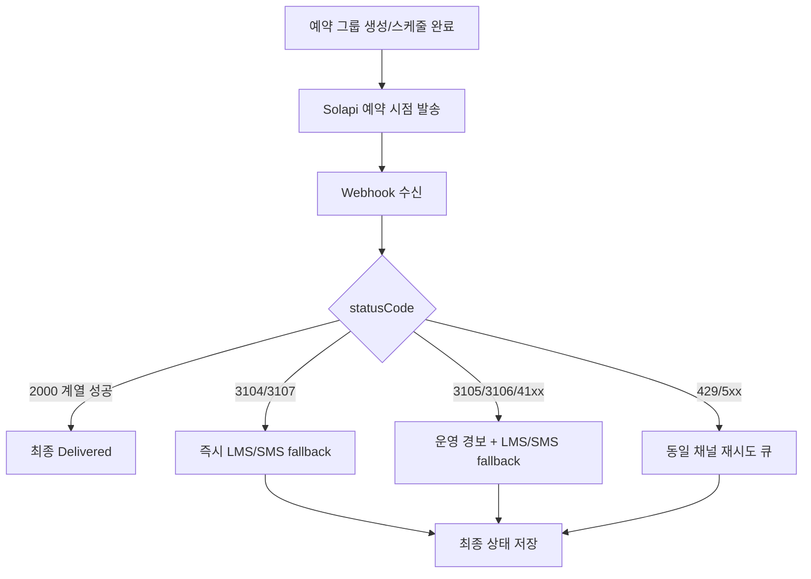

# 1) 무결점 HMAC-SHA256 인증 및 Adapter 설계

## 핵심 리서치 포인트

Solapi REST v4는 `Authorization: HMAC_SHA256` 규격을 사용합니다. 공식 Node SDK 소스에서는 `signature = HMAC_SHA256(apiSecret, date + salt)` 후 `HMAC-SHA256 apiKey=..., date=..., salt=..., signature=...` 형식으로 Authorization 문자열을 구성합니다. 또한 공식 튜토리얼/커뮤니티 예시에서는 `new Date().toISOString()` 기반 UTC 시각을 사용하고 있어, **운영에서는 반드시 `toISOString()`을 강제하여 `Z`가 붙는 UTC ISO 8601 문자열만 쓰는 것이 안전**합니다. 공식 SDK 소스의 `formatISO(new Date())`는 실행 환경 타임존에 따라 `+09:00`처럼 offset 문자열이 생성될 여지가 있어, VOXERA 같은 프로덕션 어댑터에서는 이 부분을 더 엄격하게 보정해야 합니다. [Source](https://solapi.com/developers/api/start) [Source](https://github.com/solapi/solapi-nodejs/blob/master/src/lib/authenticator.ts) [Source](https://developers.solapi.dev/tutorial/2025/05/15/send-sms-with-google-apps-script)

### 실무적으로 해석하면
- **date**: `new Date().toISOString()`만 허용
- **salt**: 16바이트 랜덤 → hex 32자리 권장
- **signature input**: `date + salt`
- **digest**: hex
- **헤더**: Authorization 하나로 전달

> 사용자 요구의 “16바이트 random hex”는 실무적으로 매우 좋은 선택입니다.  
> `randomBytes(16).toString('hex')`는 **32 hex chars = 16 bytes entropy**이므로, 공식 SDK의 32문자 salt와 동등 이상으로 안전하면서 형식도 예측 가능합니다.  
> 즉, **“공식 규격을 만족하면서 더 안전한 사내 표준”**으로 채택하기 좋습니다.

---

## 권장 TypeScript 설계

### 1-A. 인증 전용 유틸

```ts
// src/integrations/solapi/solapi-auth.ts
import crypto from 'node:crypto';

export interface Clock {
  now(): Date;
}

export interface SaltGenerator {
  next(): string; // 32-char hex
}

export class SystemClock implements Clock {
  now(): Date {
    return new Date();
  }
}

export class HexSaltGenerator implements SaltGenerator {
  next(): string {
    return crypto.randomBytes(16).toString('hex'); // 16 bytes -> 32 hex chars
  }
}

export interface SolapiCredentials {
  apiKey: string;
  apiSecret: string;
}

export interface SolapiAuthHeaders {
  Authorization: string;
  'Content-Type': 'application/json';
}

export class SolapiAuthSigner {
  constructor(
    private readonly creds: SolapiCredentials,
    private readonly clock: Clock = new SystemClock(),
    private readonly saltGen: SaltGenerator = new HexSaltGenerator(),
  ) {}

  sign(): SolapiAuthHeaders {
    const date = this.clock.now().toISOString(); // 반드시 UTC + Z
    const salt = this.saltGen.next();

    if (!/^[0-9a-f]{32}$/i.test(salt)) {
      throw new Error('SOLAPI_AUTH_INVALID_SALT');
    }

    const signature = crypto
      .createHmac('sha256', this.creds.apiSecret)
      .update(date + salt, 'utf8')
      .digest('hex');

    return {
      Authorization:
        `HMAC-SHA256 apiKey=${this.creds.apiKey}, date=${date}, salt=${salt}, signature=${signature}`,
      'Content-Type': 'application/json',
    };
  }
}
```

### 왜 이 구현이 더 안전한가
- 타임존 의존 제거: `toISOString()` 고정
- salt 형식 검증 내장
- signer를 순수 객체로 분리하여 mock test 용이
- 런타임 비밀키 외부 노출 없음
- fetch/axios 교체 가능

---

### 1-B. HTTP 추상화 + Mock 가능 구조

```ts
// src/integrations/solapi/http.ts
export type HttpMethod = 'GET' | 'POST' | 'PUT' | 'DELETE';

export interface HttpRequest {
  method: HttpMethod;
  path: string;              // ex) /messages/v4/groups
  body?: unknown;
  headers?: Record<string, string>;
}

export interface HttpResponse<T = unknown> {
  status: number;
  data: T;
}

export interface HttpClient {
  request<T>(req: HttpRequest): Promise<HttpResponse<T>>;
}
```

```ts
// src/integrations/solapi/fetch-http-client.ts
export class FetchHttpClient implements HttpClient {
  constructor(private readonly baseUrl: string) {}

  async request<T>(req: HttpRequest): Promise<HttpResponse<T>> {
    const res = await fetch(`${this.baseUrl}${req.path}`, {
      method: req.method,
      headers: req.headers,
      body: req.body ? JSON.stringify(req.body) : undefined,
    });

    const json = await res.json().catch(() => ({}));
    return { status: res.status, data: json as T };
  }
}
```

```ts
// src/integrations/solapi/mock-http-client.ts
export class MockHttpClient implements HttpClient {
  private queue: Array<{ match: Partial<HttpRequest>; response: HttpResponse<any> }> = [];

  enqueue(match: Partial<HttpRequest>, response: HttpResponse<any>) {
    this.queue.push({ match, response });
  }

  async request<T>(req: HttpRequest): Promise<HttpResponse<T>> {
    const found = this.queue.find(item =>
      (!item.match.method || item.match.method === req.method) &&
      (!item.match.path || item.match.path === req.path)
    );

    if (!found) {
      throw new Error(`MOCK_NOT_FOUND: ${req.method} ${req.path}`);
    }

    return found.response as HttpResponse<T>;
  }
}
```

---

### 1-C. Plug-and-Play `SolapiAdapter`

```ts
// src/integrations/solapi/solapi-adapter.ts
type SolapiGroupCreateRes = { groupId: string; status?: string };
type SolapiGroupRes = { groupId: string; status: string; scheduledDate?: string };
type SolapiAddMessagesRes = {
  errorCount: string | number;
  resultList: Array<{
    to: string;
    messageId: string;
    statusCode: string;
    statusMessage: string;
  }>;
};

export interface CreateGroupInput {
  allowDuplicates?: boolean;
  appId?: string;
  strict?: boolean;
  customFields?: Record<string, string>;
}

export class SolapiAdapter {
  constructor(
    private readonly http: HttpClient,
    private readonly auth: SolapiAuthSigner,
  ) {}

  private headers() {
    return this.auth.sign();
  }

  async createGroup(input: CreateGroupInput = {}): Promise<SolapiGroupCreateRes> {
    const res = await this.http.request<SolapiGroupCreateRes>({
      method: 'POST',
      path: '/messages/v4/groups',
      headers: this.headers(),
      body: {
        allowDuplicates: input.allowDuplicates ?? false,
        appId: input.appId,
        strict: input.strict ?? true,
        customFields: input.customFields,
      },
    });
    return res.data;
  }

  async addMessages(groupId: string, messages: unknown[]): Promise<SolapiAddMessagesRes> {
    const res = await this.http.request<SolapiAddMessagesRes>({
      method: 'PUT',
      path: `/messages/v4/groups/${groupId}/messages`,
      headers: this.headers(),
      body: { messages },
    });
    return res.data;
  }

  async scheduleGroup(groupId: string, scheduledDateUtcIso: string): Promise<SolapiGroupRes> {
    const res = await this.http.request<SolapiGroupRes>({
      method: 'POST',
      path: `/messages/v4/groups/${groupId}/schedule`,
      headers: this.headers(),
      body: { scheduledDate: scheduledDateUtcIso },
    });
    return res.data;
  }

  async cancelScheduledGroup(groupId: string): Promise<SolapiGroupRes> {
    const res = await this.http.request<SolapiGroupRes>({
      method: 'DELETE',
      path: `/messages/v4/groups/${groupId}/schedule`,
      headers: this.headers(),
    });
    return res.data;
  }
}
```

---

## 왜 Raw REST Adapter가 공식 SDK보다 유리한가

공식 SDK는 훌륭한 레퍼런스지만, 현재 SDK 소스 기준으로 `groupService.createGroup()`는 `allowDuplicates`, `appId`, `customFields`는 노출하되 docs snippet에 보이는 `strict`는 wrapper 수준에서 빠져 있습니다. VOXERA는 승인 직후 즉시 프로덕션 투입해야 하므로, **SDK wrapper가 감추는 필드까지 직접 노출하는 REST adapter**가 더 안전합니다. [Source](https://github.com/solapi/solapi-nodejs/blob/master/src/services/messages/groupService.ts) [Source](https://developers.solapi.dev/references/messages/groups/createMessageGroup)

---

## Mock 기반 테스트 전략

### 1-D. 인증 벡터 테스트
```ts
import { SolapiAuthSigner, Clock, SaltGenerator } from './solapi-auth';

class FixedClock implements Clock {
  now() {
    return new Date('2026-03-31T10:15:30.000Z');
  }
}

class FixedSalt implements SaltGenerator {
  next() {
    return '0123456789abcdef0123456789abcdef';
  }
}

it('builds deterministic authorization header', () => {
  const signer = new SolapiAuthSigner(
    { apiKey: 'AK', apiSecret: 'SECRET' },
    new FixedClock(),
    new FixedSalt(),
  );

  const headers = signer.sign();

  expect(headers.Authorization).toContain('apiKey=AK');
  expect(headers.Authorization).toContain('date=2026-03-31T10:15:30.000Z');
  expect(headers.Authorization).toContain('salt=0123456789abcdef0123456789abcdef');
});
```

### 1-E. API 호출 Mock 테스트
```ts
it('creates and schedules a group without hitting Solapi', async () => {
  const http = new MockHttpClient();
  const auth = new SolapiAuthSigner(
    { apiKey: 'AK', apiSecret: 'SECRET' },
    new FixedClock(),
    new FixedSalt(),
  );
  const adapter = new SolapiAdapter(http, auth);

  http.enqueue(
    { method: 'POST', path: '/messages/v4/groups' },
    { status: 200, data: { groupId: 'grp_123', status: 'PENDING' } },
  );

  http.enqueue(
    { method: 'POST', path: '/messages/v4/groups/grp_123/schedule' },
    { status: 200, data: { groupId: 'grp_123', status: 'SCHEDULED' } },
  );

  const group = await adapter.createGroup({ strict: true });
  const scheduled = await adapter.scheduleGroup(group.groupId, '2026-04-01T01:00:00.000Z');

  expect(group.groupId).toBe('grp_123');
  expect(scheduled.status).toBe('SCHEDULED');
});
```

---

# 2) 장기/대량 예약 발송용 Group API 아키텍처

## 공식 동작 근거

공식 SDK 소스에서 그룹 관련 REST 경로는 아래처럼 확인됩니다.

- `POST /messages/v4/groups` : 그룹 생성
- `PUT /messages/v4/groups/{groupId}/messages` : 그룹 메시지 추가
- `POST /messages/v4/groups/{groupId}/schedule` : 예약
- `DELETE /messages/v4/groups/{groupId}/schedule` : 예약 취소

또한 공식 검색 스니펫 기준으로 그룹 메시지 추가 API는 **요청당 총 15MB 이하**, **요청당 수신번호 10,000개 이하**, **그룹당 최대 1,000,000 메시지** 제한이 있습니다. 예약 수정 문서 스니펫은 **`SCHEDULED` 상태 그룹만 수정 가능**, **최대 6개월까지 예약 가능**이라고 명시합니다. 예약 취소 문서 스니펫은 **취소 시 그룹 상태가 `FAILED`로 변경**된다고 설명합니다. [Source](https://github.com/solapi/solapi-nodejs/blob/master/src/services/messages/groupService.ts) [Source](https://developers.solapi.dev/references/messages/groups/addGroupMessages) [Source](https://developers.solapi.dev/references/messages/groups/updateScheduleGroupMessage) [Source](https://developers.solapi.dev/references/messages/groups/cancelScheduledGroupMessage)

---

## 추천 흐름

```mermaid
flowchart TD
    A[VOXERA user intent 생성] --> B[LLM이 자연어 시간 파싱]
    B --> C[timezone 보정 후 UTC ISO 변환]
    C --> D[내부 DB에 MessageIntent 저장]
    D --> E[POST /messages/v4/groups]
    E --> F[PUT /groups/{groupId}/messages]
    F --> G[POST /groups/{groupId}/schedule]
    G --> H[DB status = SCHEDULED]
    H --> I[Solapi가 예약 시점에 발송]
    I --> J[Webhook/상태동기화 수신]
    J --> K[성공 확정 또는 fallback 실행]
```

---

## 핵심 설계 원칙

### 원칙 1. 서버 Cron/Sleep 금지
예약 실행은 Solapi가 맡고, VOXERA는 **의도 생성 / 예약 제출 / 상태 동기화**만 담당합니다. 이렇게 해야 재배포, 인스턴스 재시작, 큐 지연, DST(서머타임) 문제로 예약이 깨지지 않습니다. [Source](https://developers.solapi.dev/references/messages/groups/updateScheduleGroupMessage)

### 원칙 2. “자연어 시간”은 반드시 UTC로 고정 저장
사용자가 “내일 오후 3시”, “다음 주 월요일 오전 9시”라고 말하면,
- 기준 timezone: 사용자 workspace timezone
- 해석 결과: local datetime
- 저장/전송: `scheduledDateUtc = ZonedTime -> UTC ISO string`

### 원칙 3. 과거 시각은 앱에서 선차단
공식 예제는 과거 시간을 넣으면 즉시 발송된다고 안내합니다. 이건 UX적으로 매우 위험합니다. VOXERA는 **기본 정책상 과거 시각 입력을 400으로 거절**하고, 정말 의도적 즉시발송일 때만 `sendNow=true`를 사용하게 만드는 것이 맞습니다. [Source](https://github.com/solapi/solapi-nodejs/blob/master/examples/javascript/common/src/kakao/send/send_alimtalk.js)

---

## 시간 파서 예시

```ts
// src/domain/scheduling/normalize-scheduled-date.ts
import { DateTime } from 'luxon';

export function normalizeScheduledDateToUtcIso(input: {
  year: number;
  month: number;
  day: number;
  hour: number;
  minute: number;
  timezone: string; // ex. Asia/Seoul
}): string {
  const local = DateTime.fromObject(
    {
      year: input.year,
      month: input.month,
      day: input.day,
      hour: input.hour,
      minute: input.minute,
      second: 0,
      millisecond: 0,
    },
    { zone: input.timezone },
  );

  if (!local.isValid) {
    throw new Error('INVALID_SCHEDULED_DATETIME');
  }

  const utc = local.toUTC();

  if (utc <= DateTime.utc()) {
    throw new Error('SCHEDULED_DATE_MUST_BE_FUTURE');
  }

  return utc.toISO({ suppressMilliseconds: false })!;
}
```

---

## 예약 발송용 DB 스키마

### 최소 필수 테이블: `message_dispatch_jobs`

```sql
create table message_dispatch_jobs (
  id uuid primary key,
  user_id uuid not null,
  workspace_id uuid not null,

  provider text not null default 'SOLAPI',
  primary_channel text not null,         -- ATA | BMS_FREE
  fallback_channel text not null,        -- LMS | SMS
  intent_type text not null,             -- VOXERA domain intent name

  group_id text unique,                  -- Solapi groupId
  provider_status text,                  -- PENDING | SCHEDULED | SENDING | COMPLETE | FAILED
  internal_status text not null,         -- DRAFT | RESERVED | SCHEDULED | SENT | FALLBACK_SENT | FAILED | CANCELLED

  pf_id text,                            -- business channel PFID
  template_id text,                      -- ATA only
  sender_number text not null,
  recipient_count int not null,

  timezone text not null,                -- ex. Asia/Seoul
  requested_local_datetime text not null,
  scheduled_at_utc timestamptz not null,

  payload_json jsonb not null,           -- 원본 개인화 payload
  rendered_primary_json jsonb not null,  -- 실제 Solapi primary payload
  rendered_fallback_json jsonb,          -- LMS/SMS fallback payload

  idempotency_key text not null unique,
  created_by text not null,              -- voice-command / api / admin
  cancel_requested_at timestamptz,
  cancelled_at timestamptz,

  last_error_code text,
  last_error_message text,
  created_at timestamptz not null default now(),
  updated_at timestamptz not null default now()
);
```

### 수신자 단위 추적용: `message_dispatch_recipients`

```sql
create table message_dispatch_recipients (
  id uuid primary key,
  job_id uuid not null references message_dispatch_jobs(id),

  recipient_e164 text not null,
  recipient_hash text not null,          -- 개인정보 최소화용
  personalization_json jsonb not null,

  primary_message_id text,
  primary_status_code text,
  primary_status_message text,

  fallback_message_id text,
  fallback_status_code text,
  fallback_status_message text,

  final_delivery_channel text,           -- ATA | BMS_FREE | LMS | SMS
  final_delivery_status text,            -- DELIVERED | FAILED | PENDING
  created_at timestamptz not null default now(),
  updated_at timestamptz not null default now()
);
```

### 왜 이 메타데이터가 꼭 필요한가
예약 취소/재조회/재시도/환불/회계 정합성을 생각하면 최소한 아래는 반드시 저장해야 합니다.

- `group_id`
- `user_id`
- `workspace_id`
- `scheduled_at_utc`
- `timezone`
- `primary_channel`
- `fallback_channel`
- `pf_id`
- `template_id`
- `provider_status`
- `internal_status`
- `idempotency_key`

특히 **`group_id` + `internal_status` + `idempotency_key`** 3개가 예약/취소 중복 처리 방지의 핵심입니다.

---

## 예약 생성 서비스 예시

```ts
export class SolapiSchedulingService {
  constructor(
    private readonly adapter: SolapiAdapter,
    private readonly repo: MessageDispatchJobRepository,
  ) {}

  async createScheduledKakaoJob(input: {
    userId: string;
    workspaceId: string;
    timezone: string;
    scheduledDateUtc: string;
    messages: unknown[];
    primaryChannel: 'ATA' | 'BMS_FREE';
    fallbackChannel: 'LMS' | 'SMS';
    pfId: string;
    templateId?: string;
    idempotencyKey: string;
  }) {
    const existing = await this.repo.findByIdempotencyKey(input.idempotencyKey);
    if (existing) return existing;

    const draft = await this.repo.insertDraft(input);

    const group = await this.adapter.createGroup({
      strict: true,
      allowDuplicates: false,
      customFields: {
        jobId: draft.id,
        workspaceId: input.workspaceId,
      },
    });

    await this.adapter.addMessages(group.groupId, input.messages);
    const scheduled = await this.adapter.scheduleGroup(
      group.groupId,
      input.scheduledDateUtc,
    );

    return await this.repo.markScheduled({
      jobId: draft.id,
      groupId: group.groupId,
      providerStatus: scheduled.status,
    });
  }
}
```

---

## 취소 처리 주의점

Solapi 문서상 예약 취소는 provider 상태를 `FAILED`로 바꿉니다.  
하지만 VOXERA 도메인에서는 이걸 그대로 `FAILED`로 노출하면 사용자 오해가 생깁니다.  
따라서 **Provider status = `FAILED`, Internal status = `CANCELLED`** 로 이중 매핑하는 것이 정답입니다. [Source](https://developers.solapi.dev/references/messages/groups/cancelScheduledGroupMessage)

---

# 3) 31xx / 41xx 에러 대응 Fail-safe 및 Fallback 전략

## 공식 근거에서 확인된 포인트

공식 메시지 상태 코드 문서 검색 스니펫에서 다음 코드는 확인됩니다.

- `3104`: 카카오톡 미사용자
- `3105`: 미등록 템플릿
- `3106`: 유효하지 않은 옐로아이디
- `3107`: 72시간 이내 카카오톡 미사용자, 알림톡 차단한 사용자

또한 공식 SDK 예제와 스키마에서 `kakaoOptions.disableSms`가 존재하며, 예제 주석은 `disableSms=true`일 경우 문자 대체발송이 비활성화된다고 설명합니다. 즉, **기본적으로 Solapi 측 문자 fallback 기능이 존재하지만**, VOXERA 같은 2PC 과금 시스템에서는 이 기능을 꺼두고 앱 레벨에서 직접 fallback 하는 편이 더 안전합니다. [Source](https://developers.solapi.dev/references/message-status-codes) [Source](https://github.com/solapi/solapi-nodejs/blob/master/examples/javascript/common/src/kakao/send/send_alimtalk.js) [Source](https://github.com/solapi/solapi-nodejs/blob/master/src/models/base/kakao/kakaoOption.ts)

---

## 가장 중요한 정책 결정

## **`disableSms: true`를 기본값으로 두세요.**

이게 핵심입니다.

Solapi의 내부 자동 대체발송을 켜면 발송 보장은 쉬워지지만,
- 어떤 시점에 fallback 되었는지
- 어떤 비용이 primary/fallback에 각각 청구되었는지
- VOXERA의 2PC가 어떤 채널을 최종 commit 해야 하는지

를 완전히 통제하기 어려워집니다.

따라서 VOXERA는 다음처럼 가야 합니다.

- **1차 Kakao 발송**: `disableSms: true`
- **1차 결과 판정**: status code 확인
- **2차 fallback**: VOXERA가 직접 LMS/SMS 발송
- **과금 commit**: 최종 전달 채널 기준으로 내부 원장 확정

이 방식이 회계·감사·장애대응까지 포함해 가장 “프로덕션 레벨”입니다. [Source](https://github.com/solapi/solapi-nodejs/blob/master/examples/javascript/common/src/kakao/send/send_alimtalk.js)

---

## 실패 코드 분류 정책

### A. 즉시 fallback 가능한 recipient-side Kakao 불가
- `3104` 카카오톡 미사용자
- `3107` 최근 미사용/알림톡 차단 사용자

이 경우는 **콘텐츠나 채널 설정이 아니라 “수신자 측 사유”**라서,  
같은 Kakao 채널로 재시도할 이유가 없습니다.  
즉시 `LMS` 또는 짧으면 `SMS`로 우회하는 것이 정답입니다. [Source](https://developers.solapi.dev/references/message-status-codes)

### B. fallback은 하되, 동시에 운영 경보를 올려야 하는 config/template 계열
- `3105` 미등록 템플릿
- `3106` 유효하지 않은 옐로아이디
- `41xx` 템플릿/카카오 구성 계열 에러군

이 경우는 **개별 수신자 문제가 아니라 시스템성 장애**일 가능성이 높습니다.  
그러므로 **delivery guarantee를 위해 1회 LMS/SMS fallback은 수행**하되,  
동시에 Sev2/Slack/PagerDuty 경보를 올려야 합니다.  
왜냐하면 이건 다음 건들도 연속 실패할 가능성이 높기 때문입니다. [Source](https://developers.solapi.dev/references/message-status-codes)

> 실무 팁:  
> 41xx는 “개별 코드별 상세 문구”보다도 **“카카오 템플릿/구성 deterministic failure”라는 큰 분류로 다루는 게 아키텍처적으로 더 안전**합니다.  
> 즉, `/^41\\d{2}$/`이면 **same-channel blind retry 금지**, `fallback + ops alert`로 통일하세요.

---

## 코드 분류기

```ts
export function isKakaoRecipientIneligible(code?: string): boolean {
  return code === '3104' || code === '3107';
}

export function isKakaoConfigOrTemplateError(code?: string): boolean {
  return code === '3105' || code === '3106' || /^41\d{2}$/.test(code ?? '');
}

export function isRetryableTransportError(httpStatus?: number): boolean {
  return httpStatus === 429 || (httpStatus != null && httpStatus >= 500);
}
```

---

## fallback 라우팅 규칙

```ts
type FallbackType = 'NONE' | 'SMS' | 'LMS';

export function chooseFallback(text: string, preferred: 'SMS' | 'LMS'): FallbackType {
  // 보수적 기준: 장문/줄바꿈/URL 다수 포함 시 LMS
  if (preferred === 'LMS') return 'LMS';
  if (text.length > 90 || text.includes('\n')) return 'LMS';
  return 'SMS';
}
```

---

## 발송 오케스트레이터 예시

```ts
interface PrimarySendResult {
  ok: boolean;
  statusCode?: string;
  statusMessage?: string;
  messageId?: string;
  httpStatus?: number;
}

export class MessageDispatchService {
  constructor(
    private readonly primarySender: PrimaryKakaoSender,
    private readonly fallbackSender: SmsLmsSender,
    private readonly repo: MessageDispatchJobRepository,
    private readonly alert: AlertService,
  ) {}

  async dispatch(jobId: string): Promise<void> {
    const job = await this.repo.get(jobId);

    // 1) primary attempt
    const primary = await this.primarySender.send(job);

    await this.repo.recordPrimaryResult(jobId, primary);

    if (primary.ok) {
      await this.repo.markDelivered(jobId, job.primaryChannel);
      return;
    }

    // 2) retryable transport
    if (isRetryableTransportError(primary.httpStatus)) {
      throw new Error('RETRY_PRIMARY_LATER'); // queue retry
    }

    // 3) recipient-side fallback
    if (isKakaoRecipientIneligible(primary.statusCode)) {
      const fb = await this.fallbackSender.send(job);
      await this.repo.recordFallbackResult(jobId, fb);

      if (fb.ok) {
        await this.repo.markDelivered(jobId, fb.channel);
      } else {
        await this.repo.markFailed(jobId, fb.statusCode, fb.statusMessage);
      }
      return;
    }

    // 4) config/template deterministic failure
    if (isKakaoConfigOrTemplateError(primary.statusCode)) {
      await this.alert.notifyCritical({
        jobId,
        code: primary.statusCode,
        message: primary.statusMessage,
      });

      const fb = await this.fallbackSender.send(job);
      await this.repo.recordFallbackResult(jobId, fb);

      if (fb.ok) {
        await this.repo.markDelivered(jobId, fb.channel);
      } else {
        await this.repo.markFailed(jobId, fb.statusCode, fb.statusMessage);
      }
      return;
    }

    // 5) unknown non-retryable
    await this.repo.markFailed(jobId, primary.statusCode, primary.statusMessage);
  }
}
```

---

## 예약 발송에서도 fallback을 보장하려면

즉시 발송은 동기 응답에서 처리할 수 있지만, **예약 그룹은 예약 시점에 Solapi가 나중에 실행**합니다.  
따라서 fallback 보장을 위해서는 **webhook 기반 상태 수신**이 사실상 필수입니다.  
즉, 예약 발송 성공/실패는 `groupId`와 `messageId`를 기준으로 webhook 이벤트 또는 그룹 메시지 조회 결과를 받아 후속 fallback을 태워야 합니다. Solapi는 webhook 문서를 별도로 제공하고 있습니다. [Source](https://developers.solapi.dev/references/webhook/) [Source](https://github.com/solapi/solapi-nodejs/blob/master/src/services/messages/groupService.ts)

### 예약 fallback 흐름


---

## BMS_FREE / ATA 메시지 렌더링 전략

공식 SDK 예제 기준으로 `BMS_FREE`는 `type: 'BMS_FREE'` + `kakaoOptions.pfId` + `kakaoOptions.bms` 조합으로 발송합니다. 반면 `ATA`는 `templateId`, `variables`를 사용합니다. 따라서 내부 렌더러를 분리해야 합니다. [Source](https://github.com/solapi/solapi-nodejs/blob/master/examples/javascript/common/src/kakao/send/send_bms_free_text.js) [Source](https://github.com/solapi/solapi-nodejs/blob/master/examples/javascript/common/src/kakao/send/send_alimtalk.js) [Source](https://github.com/solapi/solapi-nodejs/blob/master/src/models/base/messages/message.ts)

### 권장 렌더러 분리
```ts
type PrimaryPayload =
  | { type: 'ATA'; kakaoOptions: { pfId: string; templateId: string; variables: Record<string, string>; disableSms: true } }
  | { type: 'BMS_FREE'; text: string; kakaoOptions: { pfId: string; bms: { targeting: 'I'; chatBubbleType: 'TEXT' }; disableSms: true } };

function renderAtaPayload(input: {
  to: string;
  from: string;
  pfId: string;
  templateId: string;
  variables: Record<string, string>;
}): object {
  return {
    to: input.to,
    from: input.from,
    type: 'ATA',
    kakaoOptions: {
      pfId: input.pfId,
      templateId: input.templateId,
      variables: input.variables,
      disableSms: true,
    },
  };
}

function renderBmsFreePayload(input: {
  to: string;
  from: string;
  pfId: string;
  text: string;
}): object {
  return {
    to: input.to,
    from: input.from,
    text: input.text,
    type: 'BMS_FREE',
    kakaoOptions: {
      pfId: input.pfId,
      disableSms: true,
      bms: {
        targeting: 'I',
        chatBubbleType: 'TEXT',
      },
    },
  };
}
```

---

# 프로덕션 레벨로 만들기 위한 추가 권장사항

## 1. `send-many/detail` 응답을 표준화
공식 SDK는 다건 발송 시 `failedMessageList`와 `groupInfo`를 돌려줍니다.  
즉, VOXERA 내부 표준 응답 DTO도 이 구조를 따라가면 later analysis가 쉬워집니다. [Source](https://github.com/solapi/solapi-nodejs/blob/master/src/models/responses/sendManyDetailResponse.ts)

## 2. idempotency key 필수
`user_id + intent_hash + scheduled_at_utc + recipient_hash_set` 조합으로 idempotency key를 만들고 unique index를 두세요.

## 3. 예약 취소 race condition 방지
취소 시:
- 내부 상태를 먼저 `CANCEL_REQUESTED`
- Solapi DELETE 호출
- 성공 시 `CANCELLED`
- 실패 시 `CANCEL_PENDING_RECONCILE`

## 4. 장애 관측성
모든 attempt에 아래를 로그화:
- `jobId`
- `groupId`
- `messageId`
- `statusCode`
- `primary/fallback channel`
- `provider_status`
- `latency_ms`

## 5. 보안
- `API_SECRET` 절대 로그 금지
- Authorization 헤더 마스킹
- PFID/templateId 검증 실패는 alert-only, raw payload는 최소 로그

---

# Codex로 바로 넘길 수 있는 작업 지시서

## 구현 순서
1. `src/integrations/solapi/solapi-auth.ts`
2. `src/integrations/solapi/http.ts`
3. `src/integrations/solapi/fetch-http-client.ts`
4. `src/integrations/solapi/mock-http-client.ts`
5. `src/integrations/solapi/solapi-adapter.ts`
6. `src/domain/messaging/renderers/ata-renderer.ts`
7. `src/domain/messaging/renderers/bms-free-renderer.ts`
8. `src/domain/messaging/renderers/lms-sms-fallback-renderer.ts`
9. `src/domain/messaging/message-dispatch.service.ts`
10. `src/domain/scheduling/normalize-scheduled-date.ts`
11. `src/api/webhooks/solapi-webhook.controller.ts`
12. `src/repositories/message-dispatch-job.repository.ts`
13. `test/solapi-auth.spec.ts`
14. `test/solapi-adapter.spec.ts`
15. `test/message-dispatch-fallback.spec.ts`