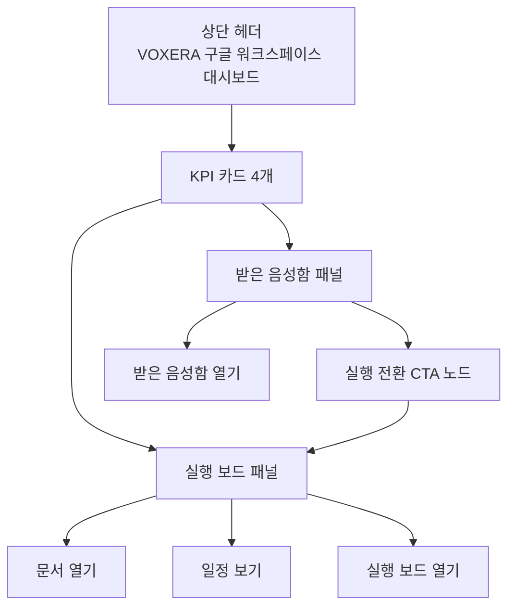

# VOXERA Google Workspace HTML Dashboard Visual Spec

이 문서는 Google Sheets 셀 레이아웃이 아니라 **Apps Script HTML 대시보드**를 위한 실전 시각 명세다.
이후 구현은 이 문서를 기준으로 한다.

## 핵심 원칙

- 첫 화면은 표가 아니라 **대시보드**여야 한다
- 사용자는 3초 안에 `검토 -> 실행 전환 -> 진행 관리` 흐름을 이해해야 한다
- `받은 음성함`, `실행 보드`, `문서 열기`, `일정 보기`는 한 화면에서 모두 보인다
- 파스텔톤, 화사함, 실행 중심, 한국어 우선
- 설명글은 최소화하고 실제로 눌러야 할 요소를 먼저 보여준다

## 레이아웃 구조

## 화면 구역

### 1. 헤더
- 제목: `VOXERA 구글 워크스페이스 대시보드`
- 우측 상단 작은 액션:
  - `받은 음성함`
  - `실행 보드`
  - `설정`

### 2. KPI 카드
- `검토할 음성`
- `진행 중 업무`
- `오늘 마감`
- `완료한 업무`

각 카드는:
- 같은 크기
- 같은 높이
- 같은 간격
- 파스텔톤 테두리
- 중앙 정렬 숫자

### 3. 받은 음성함 패널
보이는 핵심 요소만:
- 한 줄 요약
- 말한 사람
- 우선순위
- 마감일
- 상태

하단 액션:
- `받은 음성함 열기`

### 4. 실행 전환 노드
가운데 연결 영역:
- `실행 전환`
- 좌우를 잇는 부드러운 화살표
- 버튼처럼 보이되 과하지 않게

### 5. 실행 보드 패널
보이는 핵심 요소만:
- 할 일
- 담당자
- 상태
- 우선순위
- 마감일

하단 액션:
- `문서 열기`
- `일정 보기`
- `실행 보드 열기`

## 스타일 규칙

- 배경: 아주 밝은 크림/화이트
- 카드: 화이트 + 파스텔 보더 + 부드러운 그림자
- 제목: 진한 네이비
- 받은 음성함: 민트/스카이블루 계열
- 실행 보드: 피치/샌드 계열
- 문서 열기: 선명한 블루 버튼
- 일정 보기: 선명한 그린 버튼
- 실행 보드 열기: 진한 네이비 버튼

## 인터랙션 규칙

- `받은 음성함 열기`: 받은 음성함 시트로 이동
- `문서 열기`: Google Docs 링크 열기
- `일정 보기`: Google Calendar 링크 열기
- `실행 보드 열기`: 실행 보드 시트로 이동

## 구현 우선순위

1. HTML 카드 레이아웃
2. KPI 숫자 렌더링
3. 받은 음성함 / 실행 보드 preview 데이터 바인딩
4. 문서 / 일정 버튼 연결
5. Apps Script `showSidebar()` 또는 `showModalDialog()` 연결
