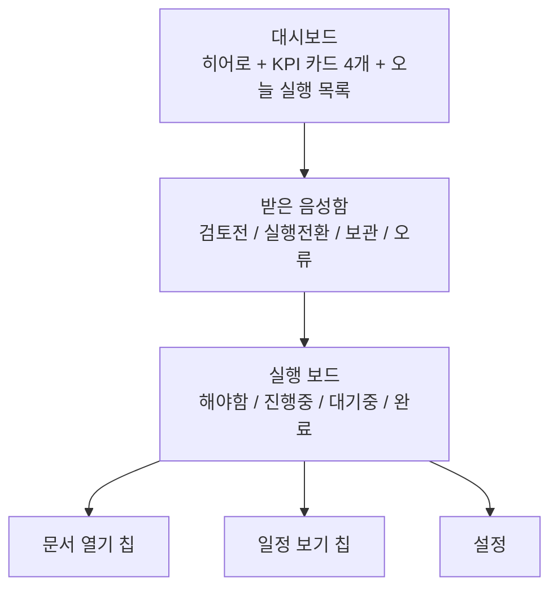
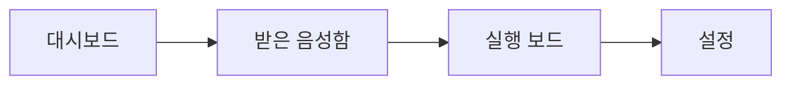
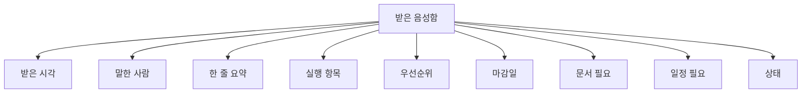
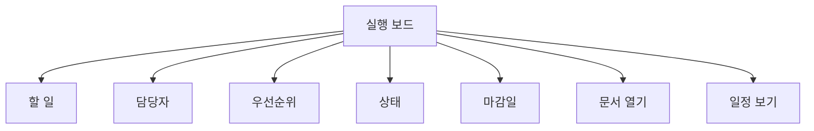
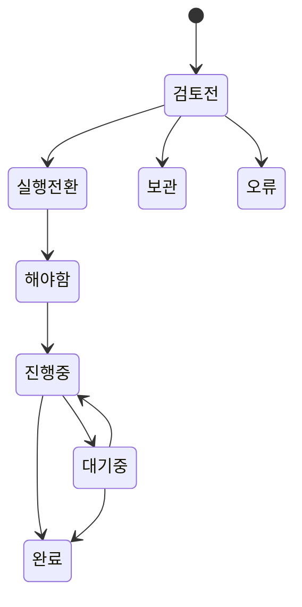
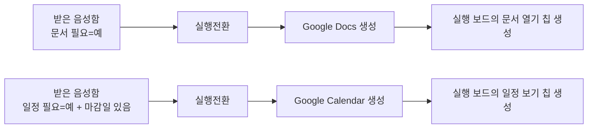
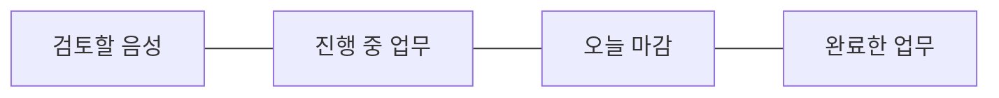

# VOXERA Google Workspace Simple Visual Spec

이 문서는 코드보다 먼저 보는 시각 설계도다.
앞으로 Google Workspace 구조 변경은 이 문서를 먼저 검토한 뒤 진행한다.

중요:
- 설명 문구는 최소화한다
- 실제 시트에서 사용자가 보게 될 요소만 남긴다
- 긴 부연 문장은 시각 시안에서 제거한다

## 1. 화면 구조 블루프린트

## 2. 사용자에게 보이는 탭

설계 원칙:
- `대시보드`가 첫 화면
- `받은 음성함`은 검토용
- `실행 보드`는 작업용
- `설정`은 관리자용

## 3. 받은 음성함 시각 구조

사용자는 여기서 딱 두 가지만 판단한다.
- 이게 진짜 실행할 일인가
- 문서/일정이 필요한가

## 4. 실행 보드 시각 구조

설계 원칙:
- 기본 작업 컬럼은 왼쪽에 고정
- 문서/일정은 긴 URL이 아니라 짧은 클릭 칩
- `문서 열기`는 파란색 칩
- `일정 보기`는 초록색 칩

## 5. 상태 전환 흐름

## 6. 문서/일정 생성 흐름

## 7. 대시보드 카드 구조

카드 아래에는 항상:
- 오늘 바로 봐야 할 실행 항목 5개

## 8. 이번 수정에서 고정한 시각 규칙

- 최상단 제목은 `VOXERA 구글 워크스페이스 대시보드`
- 히어로 탭은 한 줄 정렬, 같은 간격, 같은 기준선
- `실행 보드` 탭은 다른 탭보다 약간 크게 강조
- `받은 음성함`, `실행 보드` 섹션 제목은 더 크게
- `실행 전환`은 별도 캡슐형 배지 + 고급 화살표
- KPI 4개 카드는 같은 크기, 같은 높이, 같은 간격
- 상단 긴 컬러 바와 설명 문구는 제거
- 전체 톤앤매너는 밝은 파스텔 + 부드러운 그림자 유지

## 9. 색상 규칙

- `대시보드`: 하늘색/민트 배경
- `받은 음성함`: 아주 연한 하늘색 헤더
- `실행 보드`: 아주 연한 살구색 헤더
- `문서 열기`: 파란 칩
- `일정 보기`: 초록 칩
- `해야함`: 노랑
- `진행중`: 하늘색
- `대기중`: 연보라
- `완료`: 연초록

## 10. 구현 전 체크 질문

- 사용자가 첫 화면에서 무엇을 해야 하는지 3초 안에 이해되는가
- 링크를 숨기지 않고도 문서/일정 생성 여부를 인지할 수 있는가
- 표가 아니라 실행 대시보드처럼 보이는가
- 한국어 초보 사용자도 용도를 바로 이해할 수 있는가
