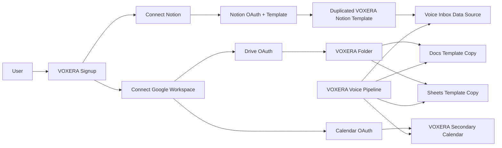

# VOXERA Workspace Onboarding Architecture

Last updated: 2026-03-21

## Goal

Provision a user's execution workspace with minimal onboarding friction across:

- Notion
- Google Docs
- Google Sheets
- Google Calendar

The target experience is:

1. User signs up once.
2. User connects a workspace provider with one OAuth consent flow.
3. A usable execution workspace appears immediately.
4. VOXERA can write transformed voice results directly into that workspace without extra manual setup when supported.

## Executive Summary

### Recommended default architecture

- Notion:
  - Use a public OAuth integration.
  - Pass a `template` option during the OAuth authorization flow.
  - Let Notion install the integration, duplicate the VOXERA template, and share the duplicated page with the integration in one flow.
  - After install, discover the duplicated `Voice Inbox` data source and write directly to it with `POST /v1/pages`.

- Google Docs / Sheets:
  - Use Google OAuth.
  - After consent, create a `VOXERA` folder in the user's Drive.
  - Copy master template files into that folder using Drive copy APIs.
  - Persist created file IDs in VOXERA.

- Google Calendar:
  - Use Google OAuth.
  - Create a dedicated secondary calendar such as `VOXERA`.
  - Seed it with starter events or reminders if needed.
  - Do not model Calendar as a file-template duplication problem.

### Why this is the best fit

- It minimizes user friction while preserving high-fidelity workspace setup.
- It avoids rebuilding complex Notion UI structures through APIs that do not fully support view management.
- It gives VOXERA direct write access to the user's chosen source of truth after initial consent.

## Product Principles

1. One consent when possible.
2. High-fidelity templates over low-fidelity API reconstruction.
3. Direct write to the destination system whenever feasible.
4. Keep Make.com or other routers optional, not mandatory, for the primary ingestion path.
5. Treat execution systems as the system of record, not a mirrored afterthought.

## System Overview

## Notion Implementation

### Recommended provisioning model

Use a Notion public integration with OAuth and the authorization `template` option.

This is preferable to reconstructing the dashboard through the API because:

- Notion API can create pages and databases/data sources.
- Notion API does not fully support view management in the way needed for a polished dashboard.
- Template duplication preserves the UI structure, page hierarchy, and prebuilt views much more reliably.

### User flow

1. User clicks `Start with Notion` in VOXERA.
2. VOXERA redirects to Notion OAuth authorization.
3. Authorization URL includes the `template` parameter pointing to the master VOXERA template.
4. User approves access.
5. Notion:
   - installs the integration,
   - duplicates the template into the user's workspace,
   - shares the duplicated template with the integration.
6. VOXERA exchanges the authorization code for an access token.
7. VOXERA persists:
   - access token,
   - workspace ID,
   - bot ID,
   - duplicated template root page ID if provided or discoverable.
8. VOXERA traverses the duplicated workspace tree to find:
   - `Voice Inbox`,
   - `Execution Board`,
   - guide pages if needed.

### Required Notion components

- Master public template maintained by VOXERA admin.
- Public OAuth integration.
- Server-side token exchange endpoint.
- Workspace discovery job to locate duplicated template assets.
- Direct page creation pipeline into `Voice Inbox`.

### Notion API responsibilities

- Exchange OAuth code for token.
- Discover pages/databases/data sources.
- Create new pages in `Voice Inbox`.
- Optionally update statuses or enrich content later.

### Notion API limitations to respect

- Do not assume you can fully recreate complex database views through the API.
- Do not assume template duplication should be implemented as a custom copy engine.
- Do not rely on Notion Custom Agents as the default required path for all users.

### Data write path

After workspace install is complete, VOXERA should write voice results directly to Notion.

Recommended target:

- `Voice Inbox` data source

Recommended payload fields:

- title
- raw transcript
- summary
- action items
- audio created at
- source metadata
- idempotency key

### Idempotency

Every direct write must include a stable VOXERA-side idempotency key.

Recommended strategy:

- Maintain `external_request_id` in VOXERA.
- Store the mapping of request ID to Notion page ID.
- Before creating a page, check whether this request ID has already been written.
- If already written, return existing page ID instead of creating again.

### Failure handling

- If OAuth succeeds but discovery fails:
  - mark workspace as `connected_pending_discovery`
  - retry discovery asynchronously
- If direct page creation fails:
  - queue retry with exponential backoff
  - mark destination sync status in VOXERA
- If token becomes invalid:
  - mark workspace as `reauthorization_required`

### Notion data model to persist in VOXERA

- `user_id`
- `provider = notion`
- `workspace_id`
- `access_token`
- `refresh_token` if provided by provider flow in future support
- `bot_id`
- `template_root_page_id`
- `voice_inbox_data_source_id`
- `execution_board_data_source_id`
- `connection_status`
- `last_discovery_at`

## Google Docs / Sheets Implementation

### Recommended provisioning model

Use Google OAuth and Drive copy APIs.

This is the best approach because Docs and Sheets are file-based assets and copy cleanly from master templates.

### User flow

1. User clicks `Connect Google Workspace`.
2. VOXERA redirects to Google OAuth.
3. User approves Drive, Docs, Sheets, and optionally Calendar scopes.
4. VOXERA creates a `VOXERA` folder in the user's Drive.
5. VOXERA copies:
   - master Docs template,
   - master Sheets template
   into that folder.
6. VOXERA persists copied file IDs and folder ID.

### Provisioned asset strategy

- Keep one admin-owned master Doc template.
- Keep one admin-owned master Sheet template.
- Copy these into user Drive after OAuth.

### Recommended Google file structure

`VOXERA/`

- `VOXERA Operating Guide`
- `VOXERA Execution Sheet`

### Docs usage

Use Docs for:

- narrative summaries,
- meeting briefs,
- execution plans,
- generated reports.

### Sheets usage

Use Sheets for:

- structured task export,
- KPI logging,
- execution tracking,
- tabular downstream sync.

### Required Google APIs

- Drive API for folder creation and file copy
- Docs API for later content updates if needed
- Sheets API for later row/tab updates if needed

### Suggested stored metadata

- `google_drive_folder_id`
- `google_docs_file_id`
- `google_sheets_file_id`
- `google_connection_status`

## Google Calendar Implementation

### Recommended provisioning model

Do not treat Calendar like a duplicated document template.

Instead:

1. Create a dedicated secondary calendar named `VOXERA`.
2. Seed it with starter reminders or execution events if needed.
3. Write future events directly into that calendar.

### Why this is preferred

- Cleaner separation from the user's main calendar.
- Easier to manage, disable, or remove later.
- Better product semantics than cloning arbitrary calendars.

### Suggested seeded events

- `VOXERA setup complete`
- `Daily execution review`
- `Weekly backlog cleanup`

### Required Calendar metadata

- `google_calendar_id`
- `calendar_connection_status`

## Unified Onboarding UX

### Recommended connection screen

Section title:

- `Connect your execution workspace`

Buttons:

- `Start with Notion`
- `Connect Google Docs & Sheets`
- `Connect Google Calendar`

### Suggested user messaging

- Notion:
  - `Install the VOXERA workspace template in one step.`
- Docs/Sheets:
  - `Create your working documents automatically in Google Drive.`
- Calendar:
  - `Create a dedicated VOXERA calendar for follow-ups and execution reminders.`

### Recommended order

1. Notion
2. Google Docs/Sheets
3. Google Calendar

## Backend Implementation Checklist

### Notion

- Register public integration
- Configure OAuth redirect URI
- Build authorization URL with template option
- Implement authorization code exchange
- Persist workspace token and bot metadata
- Discover duplicated template assets
- Resolve `Voice Inbox` and `Execution Board` IDs
- Build direct page creation into `Voice Inbox`
- Add idempotency safeguards
- Add retry queue for failed writes
- Add reauthorization detection

### Google Docs / Sheets

- Create Google OAuth client
- Request Drive/Docs/Sheets scopes
- Create `VOXERA` folder in user Drive
- Copy master Doc template
- Copy master Sheet template
- Persist copied file IDs
- Add optional sync/update jobs

### Google Calendar

- Request Calendar scopes
- Create secondary `VOXERA` calendar
- Seed starter events if desired
- Persist calendar ID
- Add event write/update flows

## Security Requirements

- Encrypt provider access tokens at rest
- Never expose provider tokens to the client
- Scope requests to only the permissions required
- Audit every workspace write with user ID and request ID
- Support disconnect and token revocation flows

## Reliability Requirements

- Idempotent create semantics for all external writes
- Exponential backoff for transient provider failures
- Dead-letter handling for repeated failure
- Observability:
  - success count
  - failure count
  - retry count
  - reauth required count

## Recommended Source of Truth Strategy

### If user connects Notion

- Notion becomes primary execution workspace.

### If user connects Google only

- Docs/Sheets become the primary execution workspace depending on feature surface.

### Do not dual-write by default

Avoid writing the same voice result to every provider automatically unless the user explicitly enables it.

Preferred default:

- one primary workspace destination
- optional secondary sync destinations later

## Product Recommendation

### Best-fit default

- Offer Notion as the primary premium execution workspace.
- Use OAuth + template option + direct write.
- Offer Google Docs/Sheets and Calendar as additional workspace provisioning options.

### Why this is aligned with VOXERA

- VOXERA is execution-first, not archive-first.
- Notion template fidelity matters for execution UX.
- Google file/calendar provisioning is robust and automatable.
- This architecture minimizes setup friction without sacrificing destination quality.

## Source Links

- Notion OAuth authorization: https://developers.notion.com/guides/get-started/authorization
- Notion authentication: https://developers.notion.com/reference/authentication
- Notion create page: https://developers.notion.com/reference/post-page
- Notion database reference: https://developers.notion.com/reference/database
- Notion data source reference: https://developers.notion.com/reference/data-source
- Notion create database: https://developers.notion.com/reference/create-a-database
- Notion create data source: https://developers.notion.com/reference/create-a-data-source
- Notion duplicate public pages: https://www.notion.com/help/duplicate-public-pages
- Notion custom agents: https://www.notion.com/help/custom-agent
- Notion custom agent pricing: https://www.notion.com/help/custom-agent-pricing
- Notion 3.3 custom agents release: https://www.notion.com/releases/2026-02-24
- Google Drive create/manage files: https://developers.google.com/workspace/drive/api/guides/create-file
- Google Drive files copy: https://developers.google.com/drive/api/v2/reference/files/copy
- Google Docs document concepts: https://developers.google.com/docs/api/concepts/document
- Google Docs create/manage docs: https://developers.google.com/workspace/docs/api/how-tos/documents
- Google Sheets create/manage spreadsheets: https://developers.google.com/workspace/sheets/api/guides/create
- Google Sheets spreadsheets.create: https://developers.google.com/workspace/sheets/api/reference/rest/v4/spreadsheets/create
- Google Calendar calendars.insert: https://developers.google.com/workspace/calendar/api/v3/reference/calendars/insert
- Google Calendar create events: https://developers.google.com/workspace/calendar/api/guides/create-events
- Google Calendar events.import: https://developers.google.com/workspace/calendar/api/v3/reference/events/import
